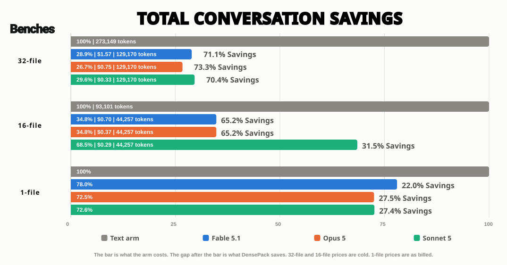
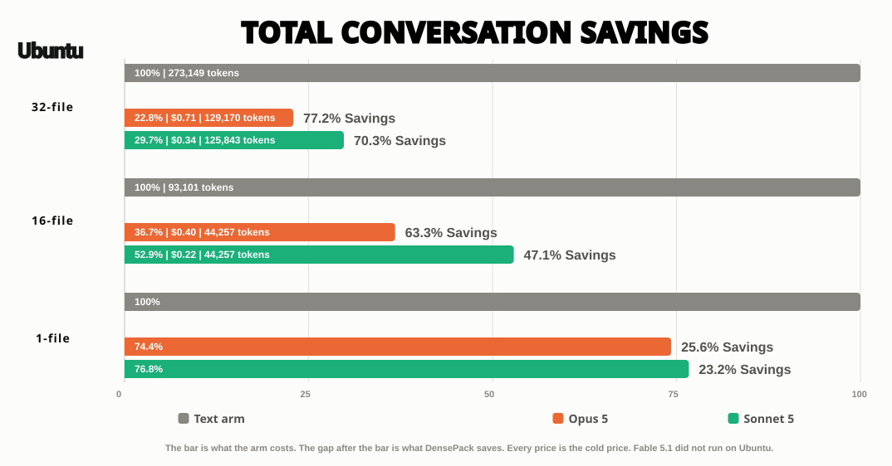

# DensePack benchmarks

Each bench gives one reader the same task two times.
The off arm reads the files as text, and the on arm reads them as images.
The two arms together make one pair.

`bench/RUN-THE-BENCHES.md` tells you how to run these.

## Current benches, 16 September 2026

### Where the numbers come from

Every price comes from the token counts the Anthropic API returned for each message of the arm.
Claude Code writes those counts into the arm's transcript, `~/.claude/projects/<folder>/<session id>.jsonl`, under `usage`.
The bench adds up `input_tokens`, `cache_creation_input_tokens`, `cache_read_input_tokens` and `output_tokens`, and multiplies them by Anthropic's published prices.
The billed price is `total_cost_usd`, the dollar figure Claude Code reports for the arm.
The token columns come from DensePack's own record, `.claude/tmp/densepack-manifest.jsonl`, in the bench folder.

Each reader gets the same images and prompt.
The 16-file and 32-file prices are the cold price of the middle of three pairs.
The 1-file prices are as billed, and both arms started with the same cache.

### Fable 5.1

| Bench   | Tokens as text | Tokens as images | Text arm | Image arm | Saving | Score  |
| ------- | -------------- | ---------------- | -------- | --------- | ------ | ------ |
| 1-file  | 1,859          | 898              | $0.0875  | $0.0682   | 22.0%  | 5 of 5 |
| 16-file | 93,101         | 44,257           | $2.01    | $0.70     | 65.2%  | 5 of 5 |
| 32-file | 273,149        | 129,170          | $5.45    | $1.57     | 71.1%  | 5 of 5 |

### Opus 5

| Bench | Tokens as text | Tokens as images | Text arm | Image arm | Saving | Score |
| --- | --- | --- | --- | --- | --- | --- |
| 1-file | 1,859 | 898 | $0.0446 | $0.0323 | 27.5% | 5 of 5 |
| 16-file | 93,101 | 44,257 | $1.05 | $0.37 | 65.2% | 5 of 5 |
| 32-file | 273,149 | 129,170 | $2.82 | $0.75 | 73.3% | 5 of 5 |

### Sonnet 5

| Bench   | Tokens as text | Tokens as images | Text arm | Image arm | Saving | Score   |
| ------- | -------------- | ---------------- | -------- | --------- | ------ | ------- |
| 1-file  | 1,859          | 898              | $0.0193  | $0.0140   | 27.4%  | 5 of 5  |
| 16-file | 93,101         | 44,257           | $0.42    | $0.29     | 31.5%  | 5 of 5  |
| 32-file | 273,149        | 129,170          | $1.13    | $0.33     | 70.4%  | 5 of 5  |

The 1-file saving is the middle of 100 runs.
Its image arm price is its text arm price less that saving.
The 1-file bench is one image at each setting, so this change cannot move it.

An image of a file costs about 50% of the text of that file.
The full conversation cuts more than 50%, because each turn after the first
reads the image again and not the text.

Each on arm answered all 5 questions correctly.

### Each pair

| Reader | Bench | Pair 1 | Pair 2 | Pair 3 | Pair 4 |
| --- | --- | --- | --- | --- | --- |
| Fable 5.1 | 32-file | 71.1% | 71.1% | 71.1% | |
| Fable 5.1 | 16-file | 64.6% | 65.2% | 68.9% | |
| Opus 5 | 32-file | 75.3% | 73.3% | 70.2% | 75.3% |
| Opus 5 | 16-file | 64.7% | 65.4% | 65.2% | 63.4% |
| Sonnet 5 | 32-file | 72.7% | 70.4% | 29.9% | 72.9% |
| Sonnet 5 | 16-file | 59.3% | 31.5% | 25.8% | 27.2% |

Fable and Opus give the same result each time.
Sonnet reads each image on some runs and only the images it must have on
others.
A run that opens only the images it must have cuts about 70%.
A run that opens each image cuts about 30%.

### Turns

The image arm uses one or two turns more than the text arm and costs less.
The price counts each turn, so a pair with more turns can count.

## Ubuntu benches, 16 September 2026

These pairs ran on Ubuntu 26.04 under WSL2, on 12 cores and 7 GB of memory, from the GitHub copy.
Claude Code 2.1.273 ran each arm in bash.
Each row is one pair at the cold price.
Both arms of every pair answered all 5 questions correctly.

### Opus 5 on Ubuntu

| Bench | Tokens as text | Tokens as images | Text arm | Image arm | Saving | Score | Verdict |
| --- | --- | --- | --- | --- | --- | --- | --- |
| 1-file | 1,859 | 898 | $0.0418 | $0.0311 | 25.6% | 5 of 5 | COUNTS |
| 16-file | 93,101 | 44,257 | $1.09 | $0.40 | 63.3% | 5 of 5 | PARTIAL |
| 32-file | 273,149 | 129,170 | $3.11 | $0.71 | 77.2% | 5 of 5 | PARTIAL |

### Sonnet 5 on Ubuntu

| Bench | Tokens as text | Tokens as images | Text arm | Image arm | Saving | Score | Verdict |
| --- | --- | --- | --- | --- | --- | --- | --- |
| 1-file | 1,859 | 898 | $0.0181 | $0.0139 | 23.2% | 5 of 5 | COUNTS |
| 16-file | 93,101 | 44,257 | $0.42 | $0.22 | 47.1% | 5 of 5 | PARTIAL |
| 32-file | 273,149 | 125,843 | $1.13 | $0.34 | 70.3% | 5 of 5 | PARTIAL |

### Each pair on Ubuntu

| Reader | Bench | Pair 1 |
| --- | --- | --- |
| Opus 5 | 32-file | 77.2% |
| Opus 5 | 16-file | 63.3% |
| Sonnet 5 | 32-file | 70.3% |
| Sonnet 5 | 16-file | 47.1% |

The Sonnet 32-file image arm read 31 of the 32 files, so its image tokens are lower.
PARTIAL means the two arms started with different cached tokens, so the pair counts at the cold price only.

## Real session, 16 September 2026

This is a real Claude Code working session, not a bench pair.
Opus 5 ran it with DensePack 0.4.62 on, over 84 model calls.
The session ran the Go tab rebuild, edited the READMEs, exported and published.

The measure reads the session's own transcript.
Anthropic's count_tokens endpoint counted each image the model received.
It also counted the exact lines each image replaced, as Bash text and as Read text.
Every later model call sends each result again, so each count is multiplied by the calls after it.
The comparison assumes the same calls on both routes.

| Measure | Images | Bash text | Read text |
| --- | --- | --- | --- |
| 6 images, read once | 6,195 | 11,035 | 12,903 |
| Saved, read once | | 43.9% | 52.0% |
| Carried on every later call | 409,421 | 732,708 | 858,493 |
| Saved, carried | | 44.1% | 52.3% |
| Saved, less the extra call | | 33.2% | 43.0% |

No image was read twice.
One call fetched images 2 and 3 of a 323-line file, and a text Read does not need that call.
That call sent 80,099 context tokens and wrote 237 output tokens, and the last row takes it off.
After each image, the API's own usage shows the context grew by more than the counted image.

The same session read 5 files through Bash as text: 6,720 tokens, carried as 317,097.
Those reads saved nothing.

These are token counts, not prices.
A cache read bills at a tenth of input, so the saving in dollars is lower.

## Previous benches, 14 September 2026

These are from the wide images.

| Reader | 32-file bench | 16-file bench | Score | Pairs | 1-file bench | Score | Runs |
| --- | --- | --- | --- | --- | --- | --- | --- |
| Fable 5.1 | 64.1% | 45.5% | 5 of 5 | 3 | 22.0% | 5 of 5 | 100 |
| Opus 5 | 60.3% | 39.3% | 5 of 5 | 3 | 27.5% | 5 of 5 | 100 |
| Sonnet 5 | 63.9% | 47.1% | 5 of 5 | 2 and 1 | 27.4% | 5 of 5 on 99, 4 of 5 on 1 | 100 |

The 1-file numbers do not change, because that bench is one image at each
setting.
These benches are from the 14th and 16th of September, after fine-tuning sessions. 
Originally, DensePack lost over 20% on the single file bench. A month and more than a thousand benches later and Densepack now SAVES over 20% on a single file. 
