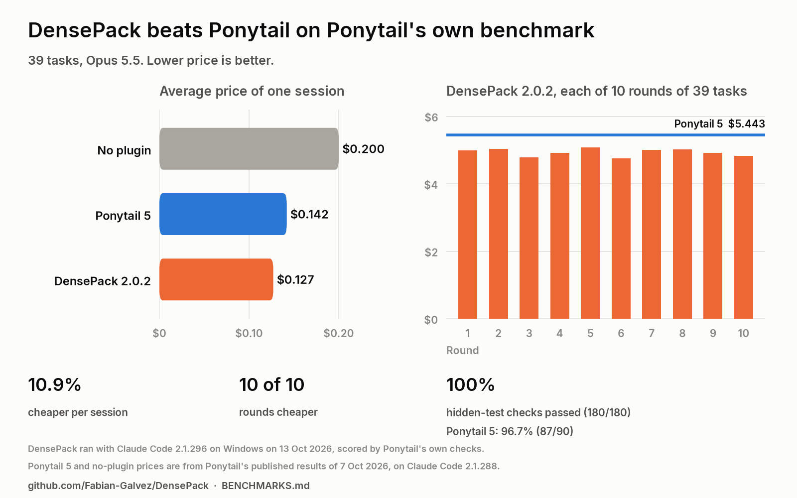
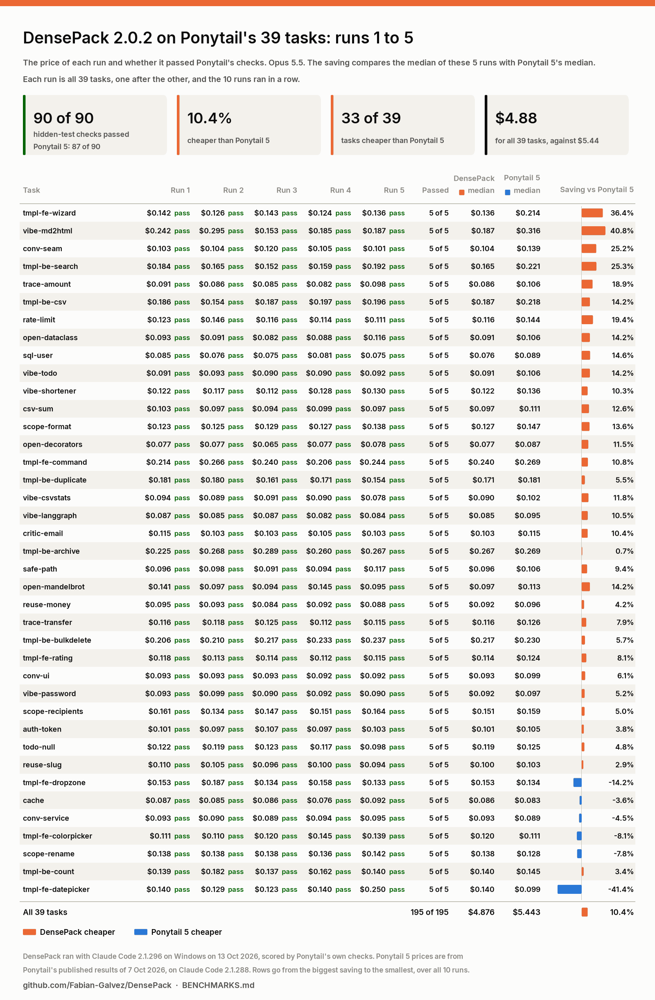
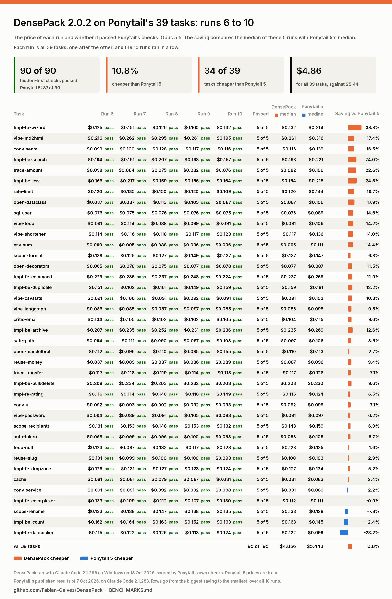

# DensePack benchmarks

In each A/B bench, the same task runs twice on the same model, once with DensePack and once without it. The price of a run is its tokens at the [Anthropic API prices](#how-anthropic-bills).

<br>

---

<br>

## DensePack 2.0.2, 13 October 2026

DensePack 2.0.2 has a start note of rules for less code and short replies. The note also names an image that maps the project's folders, files and the names in each file.

The savings below are against the price of the same task without either plugin, or against Ponytail 5 in the Ponytail table. When a saving is negative, the run cost more.

### DensePack's benches

DensePack 2.0.2 ran each bench 5 times in a row on both Opus 5.5 setups on 13 October 2026. The Sonnet 5.5 table is from DensePack 2.0 on 10 and 11 October. The runs used Claude Code 2.1.296 on Windows, `claude -p`, Bash and no Grep or Glob.

The first table of each setup contains the averages from the README. The runs table below it contains the price and the score of each run.

### Opus 5.5

| Bench | Without DensePack | DensePack 2.0.2 |
| --- | --- | --- |
| Five files read | $0.984 | $0.509, 48.3% |
| Architecture doc | $0.740 | $0.349, 52.8% |
| Read-in-full architecture | $1.810 | $0.866, 52.1% |
| Code trace | $4.737 | $2.359, 50.2% |

The price of each run:

| Run | Five files read | Architecture doc | Read-in-full architecture | Code trace |
| --- | --- | --- | --- | --- |
| 1 | $0.512, 7/7 | $0.331, 18/18 | $0.883, 18/18 | $2.016, 26/26 |
| 2 | $0.510, 7/7 | $0.342, 18/18 | $0.873, 18/18 | $2.390, 26/26 |
| 3 | $0.505, 7/7 | $0.412, 18/18 | $0.854, 18/18 | $2.865, 26/26 |
| 4 | $0.512, 7/7 | $0.323, 18/18 | $0.868, 18/18 | $2.511, 26/26 |
| 5 | $0.505, 7/7 | $0.338, 18/18 | $0.853, 18/18 | $2.013, 26/26 |

- All 20 runs count. No run was left out or run again.
- Architecture doc saves the most, because the agent writes a long document there, and the rules make it shorter.
- In five files read, the agent reads 5 named files and writes a 5-line summary, so the rules have little to cut.
- Code trace is mostly reading, with 31 to 48 Reads in each run.

<details>
<summary>DensePack 2.0 on 10 and 11 October 2026</summary>

| Bench | Without DensePack | DensePack 2.0 |
| --- | --- | --- |
| Five files read | $0.984 | $0.499, 49.3% |
| Architecture doc | $0.740 | $0.339, 54.2% |
| Read-in-full architecture | $1.810 | $0.874, 51.7% |
| Code trace | $4.737 | $2.455, 48.2% |

The price of each run:

| Run | Five files read | Architecture doc | Read-in-full architecture | Code trace |
| --- | --- | --- | --- | --- |
| 1 | $0.497, 7/7 | $0.300, 18/18 | $0.874, 18/18 | $2.920, 26/26 |
| 2 | $0.500, 7/7 | $0.364, 18/18 | $0.867, 18/18 | $2.329, 26/26 |
| 3 | $0.498, 7/7 | $0.342, 18/18 | $0.854, 18/18 | $2.088, 26/26 |
| 4 | $0.502, 7/7 | $0.355, 18/18 | $0.879, 18/18 | $2.361, 26/26 |
| 5 | $0.496, 7/7 | $0.333, 18/18 | $0.895, 18/18 | $2.576, 26/26 |

- Architecture doc saves the most, because the agent writes a long document there, and the rules make it shorter.
- In five files read, the agent reads 5 named files and writes a 5-line summary, so the rules have little to cut.
- Code trace is mostly reading, with 29 to 47 Reads in each run.

</details>

### Opus 5.5 main agent with a Sonnet 5.5 subagent

The Opus main agent gives the reading to one Sonnet 5.5 subagent, and DensePack 2.0.2 gives the rules to the subagent too. The savings are against Opus 5.5 without DensePack.

| Bench | Without DensePack | DensePack 2.0.2 with a Sonnet subagent |
| --- | --- | --- |
| Five files read | $0.984 | $0.283, 71.2% |
| Architecture doc | $0.740 | $0.415, 43.9% |
| Read-in-full architecture | $1.810 | $0.556, 69.3% |
| Code trace | $4.737 | $1.477, 68.8% |

The price of each run:

| Run | Five files read | Architecture doc | Read-in-full architecture | Code trace |
| --- | --- | --- | --- | --- |
| 1 | $0.286, 7/7 | $0.578, 18/18 | $0.536, 18/18 | $1.447, 26/26 |
| 2 | $0.293, 7/7 | $0.358, 18/18 | $0.514, 18/18 | $1.309, 26/26 |
| 3 | $0.268, 7/7 | $0.347, 18/18 | $0.532, 18/18 | $1.602, 26/26 |
| 4 | $0.284, 7/7 | $0.445, 18/18 | $0.586, 18/18 | $1.455, 26/26 |
| 5 | $0.286, 7/7 | $0.345, 18/18 | $0.612, 18/18 | $1.572, 26/26 |

- All 20 runs count. No run was left out or run again.
- With no DensePack, the Opus main agent with a Sonnet subagent cost $0.892 on the architecture doc. Against that price, DensePack 2.0.2 saved 53.5% on average. That price leaves out an estimate of the cost of the eval's Bash sandbox.

<details>
<summary>DensePack 2.0 on 10 and 11 October 2026</summary>

| Bench | Without DensePack | DensePack 2.0 with a Sonnet subagent |
| --- | --- | --- |
| Five files read | $0.984 | $0.287, 70.8% |
| Architecture doc | $0.740 | $0.333, 55.0% |
| Read-in-full architecture | $1.810 | $0.543, 70.0% |
| Code trace | $4.737 | $1.645, 65.3% |

The price of each run:

| Run | Five files read | Architecture doc | Read-in-full architecture | Code trace |
| --- | --- | --- | --- | --- |
| 1 | $0.276, 7/7 | $0.330, 18/18 | $0.651, 18/18 | $1.637, 26/26 |
| 2 | $0.286, 7/7 | $0.302, 18/18 | $0.525, 18/18 | $1.592, 26/26 |
| 3 | $0.301, 7/7 | $0.339, 18/18 | $0.535, 18/18 | $1.279, 26/26 |
| 4 | $0.287, 7/7 | $0.377, 18/18 | $0.482, 18/18 | $1.909, 26/26 |
| 5 | $0.288, 7/7 | $0.317, 18/18 | $0.521, 18/18 | $1.806, 26/26 |

- In the architecture doc, the subagent searched the scripts with Bash and read only the parts it needed, with 5 to 11 images.
- With no DensePack, the Opus main agent with a Sonnet subagent cost $0.892 on the architecture doc. Against that price, DensePack 2.0 saved 57.7% to 66.1%, 62.7% on average. That price leaves out an estimate of the cost of the eval's Bash sandbox.

</details>

### Sonnet 5.5

These runs show what a Sonnet 5.5 main agent costs with DensePack, and that Sonnet reads the images correctly.

| Bench | Without DensePack | DensePack 2.0 |
| --- | --- | --- |
| Five files read | $0.498 | $0.256, 48.6% |
| Architecture doc | $0.322 | $0.208, 35.3% |
| Read-in-full architecture | $0.826 | $0.502, 39.2% |
| Code trace | $2.706 | $2.370, 12.4% |

The price of each run:

| Run | Five files read | Architecture doc | Read-in-full architecture | Code trace |
| --- | --- | --- | --- | --- |
| 1 | $0.256, 7/7 | $0.224, 18/18 | $0.458, 18/18 | $2.287, 26/26 |
| 2 | $0.256, 7/7 | $0.201, 18/18 | $0.539, 18/18 | $2.262, 26/26 |
| 3 | $0.254, 7/7 | $0.184, 18/18 | $0.540, 18/18 | $2.512, 26/26 |
| 4 | $0.257, 7/7 | $0.213, 18/18 | $0.498, 18/18 | $2.582, 26/26 |
| 5 | $0.257, 7/7 | $0.219, 18/18 | $0.474, 18/18 | $2.208, 26/26 |

- In the architecture doc, the agent searched the 14 scripts with Bash or read only their first lines.
- Code trace took 40 to 49 API requests.

These notes apply to all runs above.

- The runs with DensePack started with `claude -p` through `bench/direct_pair.py`, with the same tools that `claude plugin eval` offers, apart from Grep and Glob. DensePack ran with the two settings from [Install the plugin](README.md#install-the-plugin), so the agent had no Grep, Glob or PowerShell tool.
- The runs without DensePack ran earlier with `claude plugin eval` on Claude Code 2.1.284 to 2.1.293, with Grep and Glob. That tool turns on the Bash sandbox, which adds sandbox instructions to each request. Their prices here leave out the cost of those instructions.
- The Sonnet prices, with and without DensePack, count cache reads at $0.20 per million tokens, the price of `claude plugin eval`, so both sides use the same price. The Anthropic price list has $0.10, so at the list price Sonnet costs less than these tables show.
- The DensePack prices are averages of 5 runs. Without DensePack, the Opus prices average 10, 24, 5 and 7 runs, in the order of the tables. The Sonnet prices average 16, 25, 5 and 6 runs.
- The runs tables contain 5 runs of each bench on each setup, and all of them scored full marks.


### Opus 5.5 with each setup


The savings are against the price without DensePack. The DensePack and Ponytail prices are averages of 5 runs, and Ponytail 5.1.0 ran with Grep and Glob. In the last column, the Opus lead gives the reading to one Sonnet 5.5 subagent.

| Bench | Without DensePack | Ponytail 5.1.0 | DensePack 2.0.2 | DensePack 2.0.2 with a Sonnet subagent |
| --- | --- | --- | --- | --- |
| Five files read | $0.984 | $0.978, 0.6% | $0.509, 48.3% | $0.283, 71.2% |
| Architecture doc | $0.740 | $0.556, 24.9% | $0.349, 52.8% | $0.415, 43.9% |
| Read-in-full architecture | $1.810 | $1.577, 12.8% | $0.866, 52.1% | $0.556, 69.3% |
| Code trace | $4.737 | $4.263, 10.0% | $2.359, 50.2% | $1.477, 68.8% |

- Ponytail adds a start note of about 2,000 tokens: its rules and a list of the function names in the folder. It costs about $0.02 per run, and $0.03 on code trace.
- DensePack adds a start note of about 2,300 tokens with its rules. The note names a project map image, 466 tokens for these 24 scripts, which the agent reads in its first turn.
- The prices of both tools already contain the cost of this extra text.

### Opus 5.5 with DensePack costs about as much as Sonnet 5.5

Without DensePack, Sonnet 5.5 costs about half as much as Opus 5.5 in these benches. With DensePack 2.0.2, Opus 5.5 costs about the same as Sonnet 5.5 without it, so you get Opus for about the price of Sonnet.

The savings are against Opus 5.5 without DensePack.

| Bench | Opus 5.5 without DensePack | Opus 5.5 with DensePack 2.0.2 | Sonnet 5.5 without DensePack |
| --- | --- | --- | --- |
| Five files read | $0.984 | $0.509, 48.3% | $0.498, 49.4% |
| Architecture doc | $0.740 | $0.349, 52.8% | $0.322, 56.5% |
| Read-in-full architecture | $1.810 | $0.866, 52.1% | $0.826, 54.4% |
| Code trace | $4.737 | $2.359, 50.2% | $2.706, 42.9% |

### Ponytail's benchmark







- [Ponytail's agentic benchmark](https://github.com/DietrichGebert/ponytail/blob/main/benchmarks/results/2026-10-07-agentic.md) has 39 tasks. They are 18 small tasks with a hidden check, 12 features in a FastAPI and React repo, 6 small apps and 3 learning examples.
- DensePack 2.0.2 ran all 39 tasks 10 times on 13 October 2026, with Opus 5.5 and Claude Code 2.1.296 on Windows. The 10 rounds ran one after another, 6 tasks at a time, from 01:10 to 01:59.
- The plugin was the `test-2.0.2` branch on GitHub at commit `c9b7a4f`, the 2.0.2 release. The agent had Bash and no Grep or Glob, the way DensePack runs on Windows. The transcripts show that all 390 runs got the exact 2.0.2 rules.
- All 390 runs count. No run was left out or run again.

| On Ponytail's 39 tasks | DensePack 2.0.2 | Ponytail 5 |
| --- | --- | --- |
| Sum of the 39 task medians | $4.845 | $5.443 |
| Saving against Ponytail 5, with medians | 11.0% | |
| Average price of a session | $0.127 | $0.142 |
| Saving against Ponytail 5, with averages | 10.9% | |
| Tasks where DensePack was cheaper | 34 of 39 | |
| Tasks where DensePack saved less than Ponytail 5 | 5: `conv-service`, `tmpl-fe-colorpicker`, `scope-rename`, `tmpl-be-count`, `tmpl-fe-datepicker` | |
| Runs that passed Ponytail's hidden tests, on 18 tasks | 180 of 180, 100% | 87 of 90, 96.7% |
| Runs that passed Ponytail's checks, on all 39 tasks | 390 of 390 | |
| Lines of code written, sum of the 39 medians | 1,118 | 1,334 |

- DensePack ran Ponytail's own tasks. The runs were scored by Ponytail's own checks, from its repo at commit `9b58c1f` of 10 October 2026. Ponytail's bench code has not changed since its results file was last updated in commit `88cedeb`.
- The bench copy of Ponytail changes 1 line in each of `tasks.py`, `judge.py` and `answer.py`. With these changes, the scorer skips DensePack's `.claude` folder, so DensePack's image files do not count as the agent's code.
- After the runs, a check of every file in the `.claude` folders of the runs found only DensePack's own images, map and state files. They do not affect the checks or the savings. The skip changes only the line count, not the price, which comes from Claude Code's own cost total.
- Before each batch, Ponytail's harness runs its self-tests and prints 2 "ok" lines, which show that its checks work. All 10 rounds printed both lines.
- After each round, a bench script read each run's transcript. It checked that the rules note arrived and that the map arrived as text or as an image Read. It also checked that no file came back as text instead of images.
- The Ponytail off and Ponytail 5 prices and lines are medians of 5 runs from Ponytail's results of 7 October 2026, on Claude Code 2.1.288. Ponytail off is the run with no plugin.
- Those runs had Grep and Glob and no Bash. Ponytail's medians include all 5 of its runs, also the runs that failed a check.
- Lines are the source lines of the delivered code. Tests do not count.
- The savings come from the prices in the table, so you can check them with the numbers shown.

With the median of 10 runs against Ponytail's median of 5, DensePack 2.0.2 cost $4.845 against Ponytail 5's $5.443, 11.0% less. It was cheaper on 34 of the 39 tasks. It wrote 1,118 lines, and Ponytail 5 wrote 1,334.

With the average of all 390 runs, a DensePack 2.0.2 session cost $0.127. Ponytail's results give an average of $0.142 per session for Ponytail 5 and $0.200 with no plugin, so DensePack cost 10.9% and 36.7% less. Ponytail publishes no average for each task, so the table compares medians.

On the 38 tasks where the run with no plugin finished, DensePack 2.0.2 cost 40.2% less than no plugin. On `vibe-md2html`, all 5 runs with no plugin timed out, so that task has no Ponytail off price.

All 390 DensePack runs passed Ponytail's own checks. On the 18 tasks with a hidden check, Ponytail's hidden tests passed in 180 of 180 DensePack runs. In Ponytail's results, Ponytail off passed 86 of 90 runs and Ponytail 5 passed 87 of 90.

On the other 21 tasks, Ponytail's check only tests that the code was delivered or compiles. Ponytail does not count that as a quality result.

The rows go from the biggest saving against Ponytail 5 to the smallest. The 5 tasks where DensePack 2.0.2 cost more are at the bottom.

| Task | Type | Ponytail off | Ponytail off lines | Ponytail 5 | Ponytail 5 lines | DensePack 2.0.2 median | DensePack 2.0.2 average | DensePack 2.0.2 lines | Runs that passed Ponytail's checks | Saving against Ponytail 5 | Saving against Ponytail off |
| --- | --- | --- | --- | --- | --- | --- | --- | --- | --- | --- | --- |
| `tmpl-fe-wizard` | repo feature | $0.678 | 311 | $0.214 | 90 | $0.134 | $0.136 | 54 | 10 of 10 | 37.2% | 80.2% |
| `vibe-md2html` | small app | timed out | 0 | $0.316 | 139 | $0.229 | $0.229 | 99 | 10 of 10 | 27.4% | no price |
| `conv-seam` | hidden check | $0.122 | 12 | $0.139 | 14 | $0.104 | $0.109 | 12 | 10 of 10 | 25.0% | 14.5% |
| `tmpl-be-search` | repo feature | $0.244 | 31 | $0.221 | 29 | $0.167 | $0.174 | 25 | 10 of 10 | 24.6% | 31.7% |
| `trace-amount` | hidden check | $0.096 | 9 | $0.106 | 9 | $0.084 | $0.086 | 10 | 10 of 10 | 20.3% | 12.0% |
| `tmpl-be-csv` | repo feature | $0.270 | 48 | $0.218 | 38 | $0.176 | $0.178 | 26 | 10 of 10 | 19.4% | 34.9% |
| `rate-limit` | hidden check | $0.147 | 44 | $0.144 | 26 | $0.120 | $0.124 | 26 | 10 of 10 | 16.9% | 18.6% |
| `open-dataclass` | learning example | $0.110 | 84 | $0.106 | 51 | $0.090 | $0.095 | 41 | 10 of 10 | 15.5% | 18.6% |
| `sql-user` | hidden check | $0.093 | 9 | $0.089 | 7 | $0.076 | $0.077 | 6 | 10 of 10 | 15.0% | 18.7% |
| `vibe-todo` | small app | $0.157 | 197 | $0.106 | 45 | $0.091 | $0.093 | 35 | 10 of 10 | 14.6% | 42.3% |
| `vibe-shortener` | small app | $0.240 | 285 | $0.136 | 79 | $0.118 | $0.120 | 51 | 10 of 10 | 13.6% | 51.0% |
| `csv-sum` | hidden check | $0.133 | 58 | $0.111 | 17 | $0.096 | $0.096 | 21 | 10 of 10 | 13.4% | 27.7% |
| `scope-format` | hidden check | $0.137 | 21 | $0.147 | 15 | $0.128 | $0.132 | 15 | 10 of 10 | 12.9% | 6.6% |
| `open-decorators` | learning example | $0.107 | 79 | $0.087 | 20 | $0.077 | $0.075 | 16 | 10 of 10 | 11.7% | 28.2% |
| `tmpl-fe-command` | repo feature | $0.431 | 319 | $0.269 | 131 | $0.238 | $0.239 | 104 | 10 of 10 | 11.4% | 44.7% |
| `tmpl-be-duplicate` | repo feature | $0.208 | 20 | $0.181 | 21 | $0.161 | $0.163 | 20 | 10 of 10 | 11.1% | 22.6% |
| `vibe-csvstats` | small app | $0.150 | 124 | $0.102 | 47 | $0.091 | $0.091 | 37 | 10 of 10 | 10.7% | 39.3% |
| `vibe-langgraph` | small app | $0.557 | 148 | $0.095 | 29 | $0.085 | $0.087 | 25 | 10 of 10 | 10.2% | 84.7% |
| `critic-email` | hidden check | $0.127 | 33 | $0.115 | 12 | $0.104 | $0.105 | 11 | 10 of 10 | 9.9% | 18.4% |
| `tmpl-be-archive` | repo feature | $0.353 | 99 | $0.269 | 59 | $0.244 | $0.247 | 59 | 10 of 10 | 9.3% | 30.9% |
| `safe-path` | hidden check | $0.117 | 16 | $0.106 | 13 | $0.097 | $0.100 | 9 | 10 of 10 | 8.8% | 17.3% |
| `open-mandelbrot` | learning example | $0.237 | 129 | $0.113 | 32 | $0.103 | $0.114 | 28 | 10 of 10 | 8.4% | 56.3% |
| `reuse-money` | hidden check | $0.083 | 9 | $0.096 | 9 | $0.088 | $0.089 | 9 | 10 of 10 | 8.1% | -6.3% |
| `trace-transfer` | hidden check | $0.135 | 27 | $0.126 | 20 | $0.116 | $0.117 | 20 | 10 of 10 | 7.6% | 13.8% |
| `tmpl-be-bulkdelete` | repo feature | $0.338 | 35 | $0.230 | 21 | $0.213 | $0.219 | 21 | 10 of 10 | 7.2% | 36.9% |
| `tmpl-fe-rating` | repo feature | $0.183 | 136 | $0.124 | 60 | $0.115 | $0.121 | 46 | 10 of 10 | 7.0% | 37.0% |
| `conv-ui` | hidden check | $0.095 | 17 | $0.099 | 17 | $0.092 | $0.092 | 17 | 10 of 10 | 6.6% | 2.6% |
| `vibe-password` | small app | $0.175 | 224 | $0.097 | 38 | $0.091 | $0.093 | 34 | 10 of 10 | 6.0% | 47.9% |
| `scope-recipients` | hidden check | $0.154 | 13 | $0.159 | 4 | $0.149 | $0.147 | 7 | 10 of 10 | 6.0% | 3.0% |
| `auth-token` | hidden check | $0.081 | 18 | $0.105 | 16 | $0.099 | $0.100 | 18 | 10 of 10 | 5.9% | -22.0% |
| `todo-null` | hidden check | $0.166 | 203 | $0.125 | 77 | $0.121 | $0.117 | 78 | 10 of 10 | 3.4% | 27.3% |
| `reuse-slug` | hidden check | $0.091 | 20 | $0.103 | 21 | $0.100 | $0.100 | 19 | 10 of 10 | 3.1% | -9.7% |
| `tmpl-fe-dropzone` | repo feature | $0.265 | 247 | $0.134 | 62 | $0.132 | $0.140 | 55 | 10 of 10 | 1.3% | 50.1% |
| `cache` | hidden check | $0.096 | 11 | $0.083 | 11 | $0.083 | $0.083 | 11 | 10 of 10 | 0.1% | 13.6% |
| `conv-service` | hidden check | $0.099 | 7 | $0.089 | 4 | $0.091 | $0.091 | 4 | 10 of 10 | -2.6% | 7.8% |
| `tmpl-fe-colorpicker` | repo feature | $0.199 | 135 | $0.111 | 26 | $0.116 | $0.122 | 24 | 10 of 10 | -4.5% | 41.7% |
| `scope-rename` | hidden check | $0.133 | 3 | $0.128 | 3 | $0.138 | $0.138 | 3 | 10 of 10 | -7.7% | -3.6% |
| `tmpl-be-count` | repo feature | $0.280 | 25 | $0.145 | 12 | $0.162 | $0.156 | 12 | 10 of 10 | -11.7% | 42.1% |
| `tmpl-fe-datepicker` | repo feature | $0.427 | 335 | $0.099 | 10 | $0.125 | $0.139 | 10 | 10 of 10 | -26.2% | 70.7% |
| **All 39** | | **$7.714, 38 tasks** | | **$5.443** | | **$4.845** | **$4.934** | | **390 of 390** | **11.0%** | **40.2%** |

The total of each round, the sum of its 39 runs:

| Round | Run folder | DensePack 2.0.2 | Ponytail 5 medians | Saving against Ponytail 5 | Ponytail off medians, 38 tasks | Saving against Ponytail off | Runs that passed |
| --- | --- | --- | --- | --- | --- | --- | --- |
| 1 | `20261013-011023` | $4.994 | $5.443 | 8.2% | $7.714 | 38.4% | 39 of 39 |
| 2 | `20261013-011532` | $5.039 | $5.443 | 7.4% | $7.714 | 38.5% | 39 of 39 |
| 3 | `20261013-012049` | $4.782 | $5.443 | 12.2% | $7.714 | 40.0% | 39 of 39 |
| 4 | `20261013-012529` | $4.920 | $5.443 | 9.6% | $7.714 | 38.6% | 39 of 39 |
| 5 | `20261013-013009` | $5.077 | $5.443 | 6.7% | $7.714 | 36.6% | 39 of 39 |
| 6 | `20261013-013536` | $4.760 | $5.443 | 12.6% | $7.714 | 41.1% | 39 of 39 |
| 7 | `20261013-014009` | $5.008 | $5.443 | 8.0% | $7.714 | 38.5% | 39 of 39 |
| 8 | `20261013-014503` | $5.015 | $5.443 | 7.9% | $7.714 | 38.8% | 39 of 39 |
| 9 | `20261013-014955` | $4.920 | $5.443 | 9.6% | $7.714 | 39.6% | 39 of 39 |
| 10 | `20261013-015437` | $4.830 | $5.443 | 11.3% | $7.714 | 39.9% | 39 of 39 |
| **All 10** | | **$49.34** | **$54.43** | **9.3%** | | | **390 of 390** |

Every run, with its price and whether it passed Ponytail's checks for correct and safe:

| Task | Run 1 | Run 2 | Run 3 | Run 4 | Run 5 | Run 6 | Run 7 | Run 8 | Run 9 | Run 10 |
| --- | --- | --- | --- | --- | --- | --- | --- | --- | --- | --- |
| `auth-token` | $0.101 pass | $0.097 pass | $0.107 pass | $0.097 pass | $0.103 pass | $0.098 pass | $0.099 pass | $0.096 pass | $0.100 pass | $0.098 pass |
| `cache` | $0.087 pass | $0.085 pass | $0.086 pass | $0.076 pass | $0.092 pass | $0.081 pass | $0.081 pass | $0.079 pass | $0.087 pass | $0.081 pass |
| `conv-seam` | $0.103 pass | $0.104 pass | $0.120 pass | $0.105 pass | $0.101 pass | $0.099 pass | $0.100 pass | $0.128 pass | $0.117 pass | $0.116 pass |
| `conv-service` | $0.093 pass | $0.090 pass | $0.089 pass | $0.094 pass | $0.095 pass | $0.091 pass | $0.091 pass | $0.092 pass | $0.092 pass | $0.088 pass |
| `conv-ui` | $0.093 pass | $0.093 pass | $0.093 pass | $0.092 pass | $0.092 pass | $0.092 pass | $0.093 pass | $0.092 pass | $0.092 pass | $0.093 pass |
| `critic-email` | $0.115 pass | $0.103 pass | $0.103 pass | $0.105 pass | $0.103 pass | $0.104 pass | $0.105 pass | $0.102 pass | $0.102 pass | $0.105 pass |
| `csv-sum` | $0.103 pass | $0.097 pass | $0.094 pass | $0.099 pass | $0.097 pass | $0.090 pass | $0.095 pass | $0.088 pass | $0.096 pass | $0.096 pass |
| `open-dataclass` | $0.093 pass | $0.091 pass | $0.082 pass | $0.088 pass | $0.116 pass | $0.087 pass | $0.087 pass | $0.113 pass | $0.105 pass | $0.087 pass |
| `open-decorators` | $0.077 pass | $0.077 pass | $0.065 pass | $0.077 pass | $0.078 pass | $0.065 pass | $0.078 pass | $0.075 pass | $0.077 pass | $0.078 pass |
| `open-mandelbrot` | $0.141 pass | $0.097 pass | $0.094 pass | $0.145 pass | $0.095 pass | $0.112 pass | $0.096 pass | $0.110 pass | $0.095 pass | $0.155 pass |
| `rate-limit` | $0.123 pass | $0.146 pass | $0.116 pass | $0.114 pass | $0.111 pass | $0.120 pass | $0.135 pass | $0.150 pass | $0.120 pass | $0.109 pass |
| `reuse-money` | $0.095 pass | $0.093 pass | $0.084 pass | $0.092 pass | $0.088 pass | $0.087 pass | $0.089 pass | $0.087 pass | $0.086 pass | $0.089 pass |
| `reuse-slug` | $0.110 pass | $0.105 pass | $0.096 pass | $0.100 pass | $0.094 pass | $0.101 pass | $0.099 pass | $0.100 pass | $0.100 pass | $0.093 pass |
| `safe-path` | $0.096 pass | $0.098 pass | $0.091 pass | $0.094 pass | $0.117 pass | $0.094 pass | $0.111 pass | $0.090 pass | $0.097 pass | $0.108 pass |
| `scope-format` | $0.123 pass | $0.125 pass | $0.129 pass | $0.127 pass | $0.138 pass | $0.138 pass | $0.125 pass | $0.127 pass | $0.149 pass | $0.137 pass |
| `scope-recipients` | $0.161 pass | $0.134 pass | $0.147 pass | $0.151 pass | $0.164 pass | $0.131 pass | $0.153 pass | $0.148 pass | $0.153 pass | $0.132 pass |
| `scope-rename` | $0.138 pass | $0.138 pass | $0.138 pass | $0.136 pass | $0.142 pass | $0.133 pass | $0.138 pass | $0.147 pass | $0.138 pass | $0.135 pass |
| `sql-user` | $0.085 pass | $0.076 pass | $0.075 pass | $0.081 pass | $0.075 pass | $0.076 pass | $0.075 pass | $0.076 pass | $0.076 pass | $0.075 pass |
| `tmpl-be-archive` | $0.225 pass | $0.268 pass | $0.289 pass | $0.260 pass | $0.267 pass | $0.207 pass | $0.235 pass | $0.252 pass | $0.231 pass | $0.236 pass |
| `tmpl-be-bulkdelete` | $0.206 pass | $0.210 pass | $0.217 pass | $0.233 pass | $0.237 pass | $0.208 pass | $0.234 pass | $0.203 pass | $0.232 pass | $0.208 pass |
| `tmpl-be-count` | $0.139 pass | $0.182 pass | $0.137 pass | $0.162 pass | $0.140 pass | $0.162 pass | $0.164 pass | $0.163 pass | $0.152 pass | $0.163 pass |
| `tmpl-be-csv` | $0.186 pass | $0.154 pass | $0.187 pass | $0.197 pass | $0.196 pass | $0.166 pass | $0.217 pass | $0.159 pass | $0.156 pass | $0.164 pass |
| `tmpl-be-duplicate` | $0.181 pass | $0.180 pass | $0.161 pass | $0.171 pass | $0.154 pass | $0.151 pass | $0.162 pass | $0.161 pass | $0.149 pass | $0.159 pass |
| `tmpl-be-search` | $0.184 pass | $0.165 pass | $0.152 pass | $0.159 pass | $0.192 pass | $0.194 pass | $0.161 pass | $0.207 pass | $0.168 pass | $0.157 pass |
| `tmpl-fe-colorpicker` | $0.111 pass | $0.110 pass | $0.120 pass | $0.145 pass | $0.139 pass | $0.133 pass | $0.109 pass | $0.112 pass | $0.107 pass | $0.130 pass |
| `tmpl-fe-command` | $0.214 pass | $0.266 pass | $0.240 pass | $0.206 pass | $0.244 pass | $0.229 pass | $0.286 pass | $0.237 pass | $0.248 pass | $0.224 pass |
| `tmpl-fe-datepicker` | $0.140 pass | $0.129 pass | $0.123 pass | $0.140 pass | $0.250 pass | $0.115 pass | $0.122 pass | $0.126 pass | $0.118 pass | $0.124 pass |
| `tmpl-fe-dropzone` | $0.153 pass | $0.187 pass | $0.134 pass | $0.158 pass | $0.133 pass | $0.126 pass | $0.131 pass | $0.127 pass | $0.128 pass | $0.124 pass |
| `tmpl-fe-rating` | $0.118 pass | $0.113 pass | $0.114 pass | $0.112 pass | $0.115 pass | $0.116 pass | $0.114 pass | $0.148 pass | $0.116 pass | $0.149 pass |
| `tmpl-fe-wizard` | $0.142 pass | $0.126 pass | $0.143 pass | $0.124 pass | $0.136 pass | $0.125 pass | $0.151 pass | $0.126 pass | $0.160 pass | $0.132 pass |
| `todo-null` | $0.122 pass | $0.119 pass | $0.123 pass | $0.117 pass | $0.098 pass | $0.123 pass | $0.097 pass | $0.132 pass | $0.117 pass | $0.123 pass |
| `trace-amount` | $0.091 pass | $0.086 pass | $0.085 pass | $0.082 pass | $0.098 pass | $0.098 pass | $0.084 pass | $0.075 pass | $0.082 pass | $0.076 pass |
| `trace-transfer` | $0.116 pass | $0.118 pass | $0.125 pass | $0.112 pass | $0.115 pass | $0.117 pass | $0.118 pass | $0.119 pass | $0.114 pass | $0.113 pass |
| `vibe-csvstats` | $0.094 pass | $0.089 pass | $0.091 pass | $0.090 pass | $0.078 pass | $0.091 pass | $0.106 pass | $0.091 pass | $0.092 pass | $0.091 pass |
| `vibe-langgraph` | $0.087 pass | $0.085 pass | $0.087 pass | $0.082 pass | $0.084 pass | $0.086 pass | $0.085 pass | $0.087 pass | $0.097 pass | $0.085 pass |
| `vibe-md2html` | $0.242 pass | $0.295 pass | $0.153 pass | $0.185 pass | $0.187 pass | $0.216 pass | $0.262 pass | $0.295 pass | $0.261 pass | $0.195 pass |
| `vibe-password` | $0.093 pass | $0.099 pass | $0.090 pass | $0.092 pass | $0.090 pass | $0.094 pass | $0.089 pass | $0.091 pass | $0.105 pass | $0.088 pass |
| `vibe-shortener` | $0.122 pass | $0.117 pass | $0.112 pass | $0.128 pass | $0.130 pass | $0.114 pass | $0.116 pass | $0.118 pass | $0.117 pass | $0.123 pass |
| `vibe-todo` | $0.091 pass | $0.093 pass | $0.090 pass | $0.090 pass | $0.092 pass | $0.091 pass | $0.114 pass | $0.088 pass | $0.089 pass | $0.091 pass |

- DensePack 2.0.2 cost more on `conv-service`, `tmpl-fe-colorpicker`, `scope-rename`, `tmpl-be-count` and `tmpl-fe-datepicker`, by 2.6% to 26.2%.
- Ponytail 5's median price on those 5 tasks is $0.111, and $0.119 on the other 34.
- DensePack 2.0.2 was cheaper on all 10 tasks where Ponytail 5 costs over $0.145. It was cheaper on 24 of the 29 tasks at or below that price.
- The 6 small apps start in an empty folder, so the agent read nothing. They still saved 6.0% to 27.4% against Ponytail 5.
- On `scope-recipients`, all 10 DensePack runs sent the digest as one message with the subscribers in Bcc, so they passed the privacy check. Each Ponytail arm passed that check in 2 of 5 runs.
- In 1 run, round 5 of `tmpl-fe-datepicker`, a Bash output stayed text. `why-text.log` gives the reason: the image and its exact-text note cost 785 + 697 tokens, more than the 1,409 tokens of text. That is the price check, and the run passed.
- The 390 runs cost $49.34 in total. Their folders on the test laptop are `20261013-011023` to `20261013-015437` in Ponytail's `benchmarks/agentic/runs`.

<details>
<summary>DensePack 2.0 on 12 October 2026: 195 runs, before the 2.0.2 rules</summary>


- DensePack ran each task 5 times on 12 October 2026, with Opus 5.5 and Claude Code 2.1.296 on Windows. The 5 rounds of all 39 tasks ran one after another, 6 tasks at a time, from 21:48 to 22:12.
- The setup was the released DensePack 2.0 rules, plus the 2.0.2 change that sends a project map under 400 characters as text. The agent had Bash and no Grep or Glob, the way DensePack runs on Windows. The transcripts show that all 195 runs got the exact released rules.
- All 195 runs count. No run was left out or run again.
- DensePack ran Ponytail's own tasks. The runs were scored by Ponytail's own checks, from its repo at commit `9b58c1f` of 10 October 2026. Ponytail's bench code has not changed since its results file was last updated in commit `88cedeb`.
- The bench copy of Ponytail changes 1 line in each of `tasks.py`, `judge.py` and `answer.py`. With these changes, the scorer skips DensePack's `.claude` folder, so DensePack's image files do not count as the agent's code.
- After the runs, a check of every file in the `.claude` folders of the runs found only DensePack's own images, map and state files. They do not affect the checks or the savings. The skip changes only the line count, not the price, which comes from Claude Code's own cost total.
- Before each batch, Ponytail's harness runs its self-tests and prints 2 "ok" lines, which show that its checks work. All 5 batches for these results printed both lines.
- After each round, a bench script read each run's transcript. It checked that the rules note arrived and that the map arrived as text or as an image Read. It also checked that no file came back as text instead of images.
- The DensePack 2.0 prices and lines are medians of all 5 runs of each task.
- The Ponytail off and Ponytail 5 prices and lines are medians of 5 runs from Ponytail's results of 7 October 2026, on Claude Code 2.1.288. Ponytail off is the run with no plugin.
- Those runs had Grep and Glob and no Bash. Ponytail's medians include all 5 of its runs, also the runs that failed a check.
- Lines are the source lines of the delivered code. Tests do not count.
- The savings come from the prices in the table, so you can check them with the numbers shown.

With the median of 5 runs on both sides, DensePack 2.0 cost $4.944 against Ponytail 5's $5.443, 9.2% less. It was cheaper on 32 of the 39 tasks. It wrote 1,145 lines, and Ponytail 5 wrote 1,334.

On the 38 tasks where the run with no plugin finished, DensePack 2.0 cost 38.9% less than no plugin. On `vibe-md2html`, all 5 runs with no plugin timed out, so that task has no Ponytail off price.

All 195 DensePack runs passed Ponytail's own checks. On the 18 tasks with a hidden check, Ponytail's hidden tests passed in 90 of 90 DensePack runs. In Ponytail's results, Ponytail off passed 86 of 90 runs and Ponytail 5 passed 87 of 90.

On the other 21 tasks, Ponytail's check only tests that the code was delivered or compiles. Ponytail does not count that as a quality result.

The rows go from the biggest saving against Ponytail 5 to the smallest. The 7 tasks where DensePack 2.0 cost more are at the bottom.

| Task | Type | Ponytail off | Ponytail off lines | Ponytail 5 | Ponytail 5 lines | DensePack 2.0 | DensePack 2.0 lines | Runs that passed Ponytail's checks | Saving against Ponytail 5 | Saving against Ponytail off |
| --- | --- | --- | --- | --- | --- | --- | --- | --- | --- | --- |
| `tmpl-fe-wizard` | repo feature | $0.678 | 311 | $0.214 | 90 | $0.130 | 57 | 5 of 5 | 39.1% | 80.8% |
| `vibe-md2html` | small app | timed out | 0 | $0.316 | 139 | $0.232 | 104 | 5 of 5 | 26.6% | no price |
| `trace-amount` | hidden check | $0.096 | 9 | $0.106 | 9 | $0.080 | 10 | 5 of 5 | 24.5% | 16.6% |
| `csv-sum` | hidden check | $0.133 | 58 | $0.111 | 17 | $0.090 | 16 | 5 of 5 | 18.8% | 32.2% |
| `tmpl-fe-command` | repo feature | $0.431 | 319 | $0.269 | 131 | $0.223 | 107 | 5 of 5 | 17.2% | 48.3% |
| `vibe-todo` | small app | $0.157 | 197 | $0.106 | 45 | $0.088 | 35 | 5 of 5 | 16.9% | 43.9% |
| `tmpl-be-search` | repo feature | $0.244 | 31 | $0.221 | 29 | $0.186 | 25 | 5 of 5 | 16.0% | 23.9% |
| `open-dataclass` | learning example | $0.110 | 84 | $0.106 | 51 | $0.091 | 45 | 5 of 5 | 14.0% | 17.1% |
| `vibe-langgraph` | small app | $0.557 | 148 | $0.095 | 29 | $0.083 | 24 | 5 of 5 | 13.2% | 85.2% |
| `sql-user` | hidden check | $0.093 | 9 | $0.089 | 7 | $0.077 | 6 | 5 of 5 | 13.1% | 16.9% |
| `conv-seam` | hidden check | $0.122 | 12 | $0.139 | 14 | $0.121 | 12 | 5 of 5 | 13.0% | 0.9% |
| `safe-path` | hidden check | $0.117 | 16 | $0.106 | 13 | $0.094 | 11 | 5 of 5 | 11.3% | 19.6% |
| `critic-email` | hidden check | $0.127 | 33 | $0.115 | 12 | $0.102 | 12 | 5 of 5 | 11.2% | 19.6% |
| `rate-limit` | hidden check | $0.147 | 44 | $0.144 | 26 | $0.128 | 27 | 5 of 5 | 11.1% | 12.9% |
| `open-decorators` | learning example | $0.107 | 79 | $0.087 | 20 | $0.077 | 19 | 5 of 5 | 11.1% | 27.7% |
| `vibe-csvstats` | small app | $0.150 | 124 | $0.102 | 47 | $0.091 | 44 | 5 of 5 | 11.0% | 39.5% |
| `tmpl-be-duplicate` | repo feature | $0.208 | 20 | $0.181 | 21 | $0.161 | 20 | 5 of 5 | 10.9% | 22.5% |
| `reuse-money` | hidden check | $0.083 | 9 | $0.096 | 9 | $0.087 | 9 | 5 of 5 | 9.7% | -4.5% |
| `trace-transfer` | hidden check | $0.135 | 27 | $0.126 | 20 | $0.114 | 20 | 5 of 5 | 9.5% | 15.5% |
| `conv-ui` | hidden check | $0.095 | 17 | $0.099 | 17 | $0.090 | 17 | 5 of 5 | 9.0% | 5.2% |
| `vibe-shortener` | small app | $0.240 | 285 | $0.136 | 79 | $0.126 | 54 | 5 of 5 | 7.7% | 47.7% |
| `vibe-password` | small app | $0.175 | 224 | $0.097 | 38 | $0.090 | 32 | 5 of 5 | 7.6% | 48.8% |
| `tmpl-be-archive` | repo feature | $0.353 | 99 | $0.269 | 59 | $0.249 | 59 | 5 of 5 | 7.5% | 29.5% |
| `scope-format` | hidden check | $0.137 | 21 | $0.147 | 15 | $0.136 | 16 | 5 of 5 | 7.4% | 0.7% |
| `todo-null` | hidden check | $0.166 | 203 | $0.125 | 77 | $0.116 | 75 | 5 of 5 | 7.3% | 30.2% |
| `tmpl-be-csv` | repo feature | $0.270 | 48 | $0.218 | 38 | $0.202 | 26 | 5 of 5 | 7.3% | 25.1% |
| `auth-token` | hidden check | $0.081 | 18 | $0.105 | 16 | $0.098 | 18 | 5 of 5 | 6.7% | -20.9% |
| `scope-recipients` | hidden check | $0.154 | 13 | $0.159 | 4 | $0.150 | 6 | 5 of 5 | 5.8% | 2.8% |
| `reuse-slug` | hidden check | $0.091 | 20 | $0.103 | 21 | $0.099 | 19 | 5 of 5 | 3.9% | -8.8% |
| `tmpl-be-bulkdelete` | repo feature | $0.338 | 35 | $0.230 | 21 | $0.225 | 21 | 5 of 5 | 2.2% | 33.5% |
| `cache` | hidden check | $0.096 | 11 | $0.083 | 11 | $0.081 | 11 | 5 of 5 | 2.1% | 15.4% |
| `tmpl-fe-colorpicker` | repo feature | $0.199 | 135 | $0.111 | 26 | $0.109 | 20 | 5 of 5 | 1.6% | 45.1% |
| `conv-service` | hidden check | $0.099 | 7 | $0.089 | 4 | $0.089 | 4 | 5 of 5 | -0.1% | 10.0% |
| `scope-rename` | hidden check | $0.133 | 3 | $0.128 | 3 | $0.133 | 3 | 5 of 5 | -4.1% | -0.2% |
| `open-mandelbrot` | learning example | $0.237 | 129 | $0.113 | 32 | $0.122 | 31 | 5 of 5 | -8.0% | 48.5% |
| `tmpl-fe-dropzone` | repo feature | $0.265 | 247 | $0.134 | 62 | $0.145 | 61 | 5 of 5 | -8.2% | 45.3% |
| `tmpl-be-count` | repo feature | $0.280 | 25 | $0.145 | 12 | $0.160 | 12 | 5 of 5 | -10.1% | 43.0% |
| `tmpl-fe-rating` | repo feature | $0.183 | 136 | $0.124 | 60 | $0.143 | 47 | 5 of 5 | -15.5% | 21.8% |
| `tmpl-fe-datepicker` | repo feature | $0.427 | 335 | $0.099 | 10 | $0.126 | 10 | 5 of 5 | -27.7% | 70.4% |
| **All 39** | | **$7.714, 38 tasks** | **3,541** | **$5.443** | **1,334** | **$4.944** | **1,145** | **195 of 195** | **9.2%** | **38.9%** |

The price of each run, in the order the runs ran:

| Task | Run 1 | Run 2 | Run 3 | Run 4 | Run 5 |
| --- | --- | --- | --- | --- | --- |
| `auth-token` | $0.100 | $0.099 | $0.098 | $0.096 | $0.096 |
| `cache` | $0.092 | $0.081 | $0.084 | $0.080 | $0.080 |
| `conv-seam` | $0.100 | $0.119 | $0.127 | $0.121 | $0.130 |
| `conv-service` | $0.082 | $0.089 | $0.091 | $0.089 | $0.090 |
| `conv-ui` | $0.090 | $0.090 | $0.090 | $0.091 | $0.090 |
| `critic-email` | $0.102 | $0.104 | $0.108 | $0.100 | $0.101 |
| `csv-sum` | $0.096 | $0.090 | $0.090 | $0.100 | $0.088 |
| `open-dataclass` | $0.091 | $0.092 | $0.089 | $0.095 | $0.087 |
| `open-decorators` | $0.081 | $0.077 | $0.080 | $0.075 | $0.076 |
| `open-mandelbrot` | $0.154 | $0.133 | $0.120 | $0.122 | $0.100 |
| `rate-limit` | $0.128 | $0.115 | $0.105 | $0.135 | $0.128 |
| `reuse-money` | $0.087 | $0.086 | $0.087 | $0.091 | $0.085 |
| `reuse-slug` | $0.099 | $0.096 | $0.099 | $0.097 | $0.103 |
| `safe-path` | $0.094 | $0.091 | $0.097 | $0.090 | $0.102 |
| `scope-format` | $0.146 | $0.144 | $0.136 | $0.135 | $0.123 |
| `scope-recipients` | $0.152 | $0.150 | $0.167 | $0.143 | $0.134 |
| `scope-rename` | $0.132 | $0.139 | $0.133 | $0.132 | $0.135 |
| `sql-user` | $0.080 | $0.074 | $0.085 | $0.077 | $0.073 |
| `tmpl-be-archive` | $0.249 | $0.270 | $0.202 | $0.228 | $0.276 |
| `tmpl-be-bulkdelete` | $0.233 | $0.225 | $0.252 | $0.214 | $0.209 |
| `tmpl-be-count` | $0.161 | $0.161 | $0.158 | $0.160 | $0.140 |
| `tmpl-be-csv` | $0.180 | $0.210 | $0.201 | $0.223 | $0.202 |
| `tmpl-be-duplicate` | $0.204 | $0.158 | $0.178 | $0.155 | $0.161 |
| `tmpl-be-search` | $0.189 | $0.175 | $0.186 | $0.159 | $0.186 |
| `tmpl-fe-colorpicker` | $0.109 | $0.138 | $0.104 | $0.107 | $0.128 |
| `tmpl-fe-command` | $0.223 | $0.223 | $0.218 | $0.237 | $0.281 |
| `tmpl-fe-datepicker` | $0.138 | $0.110 | $0.137 | $0.125 | $0.126 |
| `tmpl-fe-dropzone` | $0.173 | $0.143 | $0.131 | $0.145 | $0.157 |
| `tmpl-fe-rating` | $0.116 | $0.144 | $0.143 | $0.110 | $0.146 |
| `tmpl-fe-wizard` | $0.172 | $0.120 | $0.142 | $0.126 | $0.130 |
| `todo-null` | $0.101 | $0.126 | $0.124 | $0.116 | $0.097 |
| `trace-amount` | $0.078 | $0.080 | $0.089 | $0.075 | $0.086 |
| `trace-transfer` | $0.122 | $0.111 | $0.126 | $0.114 | $0.113 |
| `vibe-csvstats` | $0.092 | $0.089 | $0.091 | $0.089 | $0.103 |
| `vibe-langgraph` | $0.087 | $0.095 | $0.080 | $0.081 | $0.083 |
| `vibe-md2html` | $0.232 | $0.269 | $0.229 | $0.292 | $0.169 |
| `vibe-password` | $0.094 | $0.090 | $0.084 | $0.087 | $0.090 |
| `vibe-shortener` | $0.126 | $0.127 | $0.126 | $0.102 | $0.120 |
| `vibe-todo` | $0.092 | $0.090 | $0.088 | $0.087 | $0.087 |

- DensePack 2.0 cost more on `conv-service`, `scope-rename`, `open-mandelbrot`, `tmpl-fe-dropzone`, `tmpl-be-count`, `tmpl-fe-rating` and `tmpl-fe-datepicker`, by 0.1% to 27.7%. 4 of the 7 are features in the FastAPI and React repo.
- Ponytail 5's median price on those 7 tasks is $0.124, and $0.113 on the other 32. So with these rules, the tasks that cost more are not the smallest ones.
- DensePack 2.0 was cheaper on all 10 tasks where Ponytail 5 costs over $0.145. It was cheaper on 22 of the 29 tasks at or below that price.
- The 6 small apps start in an empty folder, so the agent read nothing. They still saved 7.6% to 26.6% against Ponytail 5.
- On `scope-recipients`, all 5 DensePack runs sent the digest as one message with the subscribers in Bcc, so they passed the privacy check. Each Ponytail arm passed that check in 2 of 5 runs.
- The 195 runs cost $24.89 in total. Their folders on the test laptop are `20261012-214830`, `20261012-215406`, `20261012-215843`, `20261012-220325` and `20261012-220759` in Ponytail's `benchmarks/agentic/runs`.

</details>

<br>

---

<br>

## Run these benches yourself

Run this command in the repository folder for one run with DensePack:

```
python bench/direct_pair.py five-files-read --model claude-opus-5-5 --warm --sides with --out bench-five-1
```

- The script copies your Claude Code login from `~/.claude/.credentials.json`. On macOS, Claude Code keeps the login in the Keychain, so run the benches on Windows or Linux.

- On Windows, add `--with-env EMBEDDED_SEARCH_TOOLS=1 --with-env CLAUDE_CODE_USE_POWERSHELL_TOOL=0`. The runs start in a new home folder, so the settings that DensePack writes to `~/.claude/settings.json` for later sessions never reach them. These two flags give the runs those settings.
- The cases are `five-files-read`, `architecture-doc` and `code-trace` in `plugin/evals`. For read-in-full, add `--prompt-file bench/prompts/architecture-read-all.md` to `architecture-doc`. For the benches with a subagent, add `--prompt-file bench/prompts/<name>`: `five-files-read-subagent.md` with `five-files-read`, `architecture-doc-subagent.md` and `architecture-read-all-subagent.md` with `architecture-doc`, and `code-trace-subagent.md` with `code-trace`.
- The command prints the price, the API requests and the score of the run. `bench/trace_check.py` checks that the trace is one valid run.
- `bench/savings_chart.py` contains the price of each run without DensePack in these tables and draws the chart. It needs fontTools (`pip install fonttools`), because it draws each letter as an outline of the Inter font in `plugin/fonts`.

<br>

---

<br>

## How DensePack saves

DensePack packs the files that the agent reads into images when an image costs fewer tokens than the text. Claude Code sends the smaller image again with each later request, at the cache read price. [What DensePack packs](HOW-IT-WORKS.md#what-densepack-packs) and [What are the limits?](HOW-IT-WORKS.md#the-limits) give the rules and the files that stay text.

In the byte identical rebuild, each image uses 49% to 55% fewer tokens than the text of its file. The cache read price is 0.05x of the input price on Sonnet 5.5 and Opus 5.5. It is 0.025x on Fable 5.1.
- The saving of each image grows with the number of turns after it.

<br>

---

<br>

### Models that get images

- Fable and Opus models always get images. Sonnet models get images while the maxpack setting is on. These models get the same image, with a font size of 17 px.
- The maxpack setting is on by default, which lets Sonnet get images. `/max-off` sends Sonnet text instead of images.
- Haiku gets text.
- Some Word files and the files in `.claude/densepack-vault/to-pack/` are the exception. DensePack packs them for all models, Haiku included.

<br>

---

<br>

### Bash output

DensePack also packs long Bash output into images. Some kinds of lines are easy to misread in an image, so DensePack sends them as exact text. [How the swap happens](HOW-IT-WORKS.md#how-the-swap-happens) lists them.

To find these lines, Opus 5.5 copied real Bash output from images with the exact lines turned off.

- It typed 76 of 108 random IDs with I or l wrong, each time with I and l swapped.
- It miscounted 54 of 72 `git --stat` bars.
- It typed 106 of 108 IDs without I or l correctly.
- It also typed 167 of 168 hex hashes and 160 of 160 numbers of 8 to 17 digits correctly.

Those strings stay in the image only. On that day, 597 of 8,274 real Bash outputs of 400 characters or more had such a line, about 7%.

In earlier tests, the model lost all 14 lines of only spaces and all 18 tabs inside a line. In another test, Opus 5.5 typed 33 of 34 packed Bash outputs exactly, apart from a final newline. The one miss was a lost space at the end of a row. Opus 5.5 also answered questions about exact strings in packed output.

| Input | Questions answered correctly |
| --- | --- |
| With DensePack | 59 of 60 |
| With DensePack, image only | 50 of 51 |
| Text | 60 of 60 |

<br>

---

<br>

### Subagents

- At the start of each session, DensePack sends its session note to the lead.
- DensePack also sends the note to each subagent when the subagent starts, except to a Sonnet subagent after /max-off.
- Haiku subagents get no note, because their Reads, their Bash output and their briefs stay text.
- DensePack packs subagent reports when the image costs less than the text.
- DensePack packs briefs of 1,000 characters or more the same way, in auto and bypassPermissions mode only.
- In the other modes, a change to the Agent call can skip the permission prompt, so briefs stay text.

The lead opens a packed report with one Read, because the result of the Agent tool cannot carry an image. Read results and Bash results can carry an image.

One test used a hook on the Agent tool.

- The hook replaced the result with other text. The Opus 5.5 lead read that text instead of the report, which is how `report_swap.py` swaps in the image name.
- The same hook then put an image into the result in four shapes:
  - Image block
  - Image shape of a Read result
  - Image shape of a Bash result
  - Text block with an image block
- In all four cases, the lead got the original text of the subagent.

<br>

---

<br>

### Later requests cost less

Claude Code sends the whole conversation with each request. Images cost fewer tokens than their text, so each later request sends fewer cached tokens.

In the [code trace](#opus-55) on Opus 5.5, the 5 runs with DensePack 2.0 took 33 to 56 API requests. They read 2.3 to 4.5 million tokens from the cache. The 7 runs without DensePack took 45 to 64 requests and read 7.0 to 11.6 million.

Image runs can also read less than text runs.

- If a file fills several images, the Read can return them stacked into one image. This works when the stack fits in 1,568 by 1,568 pixels, the size that DensePack sets for one joined image.
- Otherwise, a whole-file Read returns its images in one result. Like a text Read, it stops at line 2,000.
- Text runs read each file in full.

<br>

---

<br>

### Cost per message

This example uses these values.

- One file of 1,000 tokens goes with each message.
- Cache writes with a 1-hour lifetime cost 2x the input price. Cache reads cost 0.05x, the rate of Sonnet 5.5.
- DensePack packs each file into an image of 500 tokens.

| Message | Without DensePack | With DensePack |
| --- | --- | --- |
| 1 | write 1,000 at 2x = 2,000 | write 500 at 2x = 1,000 |
| 2 | read 1,000 + write 1,000 = 2,050 | read 500 + write 500 = 1,025 |
| 3 | read 2,000 + write 1,000 = 2,100 | read 1,000 + write 500 = 1,050 |
| Total after 3 | 6,150 | 3,075 |
| Total after 10 | 22,250 | 11,125 |
| Total after 50 | 161,250 | 80,625 |
| Total after 100 | 447,500 | 223,750 |

The cache read grows with each message because Claude Code sends all the earlier messages again with each message. In this example, DensePack halves each cache write and each cache read after it.

Agents often take more than one turn for one prompt. The model reads the whole conversation from the cache again on every turn, which repeats the saving of each smaller image. In the [code trace](#opus-55), the runs with DensePack 2.0 read 2.3 to 4.5 million tokens from the cache. The runs without it read 7.0 to 11.6 million.

<br>

---

<br>

## How Anthropic bills

Anthropic bills per million tokens (MTok). The price depends on the model.

| Model | Input (1x) | Cache write, 1 hour (2x) | Cache write, 5 minutes (1.25x) | Cache read | Output (5x) |
| --- | --- | --- | --- | --- | --- |
| <strong>Fable 5.1</strong> | $10 | $20 | $12.50 | $0.25 (0.025x) | $50 |
| <strong>Opus 5.5</strong> | $4 | $8 | $5 | $0.20 (0.05x) | $20 |
| <strong>Sonnet 5.5</strong> | $2 | $4 | $2.50 | $0.10 (0.05x) | $10 |

<sub>The prices come from the <strong>Model pricing</strong> table on <a href="https://platform.claude.com/docs/en/about-claude/pricing">Anthropic's pricing page</a>.</sub>

- The multipliers apply to the base input price. The cache read price is not a part of the 2x cache write price.
- `cache_creation_input_tokens` are the input tokens that Claude Code writes to the cache. They cost 2x the base input price in the 1-hour cache and 1.25x in the 5-minute cache.
- In the Opus 5.5 runs, Claude Code wrote the main conversation to the 1-hour cache. In the Sonnet 5.5 subagent runs, it wrote the conversation of each subagent to the 5-minute cache.
- Claude Code sends the whole conversation on each turn. The cache contains the part that repeats. Anthropic bills that part at the `cache_read_input_tokens` price.
- Without a cache, Anthropic bills the whole conversation at the base input price on each turn.

<br>

---

<br>

## Exact values

Opus 5.5 copied these values correctly from images of Bash output:

- 167 of 168 hex hashes
- 160 of 160 numbers of 8 to 17 digits
- 96 of 96 temp folder names

Numbers of 18 digits or more are the exception. Opus 5.5 got 2 of 64 of them wrong, so DensePack sends those lines as exact text.

The text of each image stays on disk.

- For a Read, that text is the file itself.
- Command output, Word files and the files of `.claude/densepack-vault/to-pack/` also get a text copy on disk. The key row of each image has the copy's name after `file=`, so the agent can Grep it for an exact string.
- The briefs and reports of subagents keep their text in a `.txt` file beside the image.
- The CLAUDE.md, CLAUDE.local.md, AGENTS.md, rules and MEMORY.md files keep their text in a `.bakpack` file beside them.

The text is saved as a fallback in case the agent ever needs to read text.

- Reads with offset N and limit 1 also return line N as text. N is the green line number in the image.

Reads of 20 lines or fewer stay text, so the agent can pull a few exact lines cheaply. `LINE_PULL_MAX` in `plugin/scripts/common.py` sets that limit of 20 lines.
