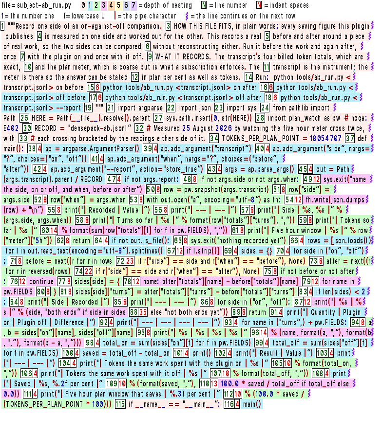

<!-- DensePack 1.3.4 -->
# How DensePack works

This file gives the full detail of each part. [README.md](README.md) has a short summary of each part.

- [What DensePack changes](#what-densepack-changes)
- [How the swap happens](#how-the-swap-happens)
- [What DensePack packs](#what-densepack-packs)
- [The Edit check](#the-edit-check)
- [The image](#the-image)
- [Word files](#word-files)
- [The slash commands](#the-slash-commands)
- [The hooks](#the-hooks)
- [The scripts](#the-scripts)

[INSTALL.md](INSTALL.md) has the install steps. [BENCHMARKS.md](BENCHMARKS.md) has the measurements and the prices. [PLUGIN-FOLDERS-FILES.md](PLUGIN-FOLDERS-FILES.md) lists each folder and working file that the plugin writes.

<br>

---

<br>

## What DensePack changes

DensePack changes some of your files and adds its own folders and packages. The slash command `/dense-remove` undoes these changes. These files stay.

- The `.gitignore` in `.claude/tmp/` stays.
- Pillow, freetype-py and NumPy stay in the data folder of the plugin until `/plugin uninstall` deletes that folder.
- Older `<name>.bakpack.old-N` copies and the conversation copies that `dpctl.py keep` makes stay.
- `.claude/densepack-vault/` and the DensePack files in `.claude/tmp/` stay in folders that no Claude Code transcript in `~/.claude/projects` names as its working folder.

| What it changes | What DensePack does | Why |
| --- | --- | --- |
| `CLAUDE.md`, `.claude/CLAUDE.md`, `CLAUDE.local.md`, `AGENTS.md` (only when the folder has no `CLAUDE.md`) and `.claude/rules/*.md` in a project, your `~/.claude/CLAUDE.md` and the auto memory index `MEMORY.md` of the project | At session start, DensePack copies the file to `<name>.bakpack` and packs the text into images. It replaces the file with a short pointer, and the pointer names each image. It converts a file only when the images and the pointer cost less than the text | Claude Code sends these files as text on each turn |
| `~/.claude/settings.json` | DensePack adds `"CLAUDE_CODE_THRIFTY_SONIC": "0"` to the `env` block one time when the key is not there | Auto mode and bypassPermissions mode tell the agent to read files with cat, head or sed in Bash. Bash reads save less than Reads |
| `.gitignore` files in `.claude/tmp/` and `.claude/densepack-vault/` | DensePack writes one line, `*` | Those folders hold copies of your files and of command output, and the `*` line keeps Git from committing them |
| `~/.claude/densepack-state` | DensePack creates the folder. It holds the path of the Python that DensePack found, the seal key `sidecar.key`, the list of the instruction files that DensePack converted and the images of your `~/.claude/CLAUDE.md`. It also holds the images of each `MEMORY.md`, in one folder for each project | DensePack reads its own notes to find the files that it converted. Cloned repositories can hold a fake copy of those notes. DensePack keeps the real notes in your home folder, where a clone cannot write |
| `~/.claude/densepack-cards` | DensePack changes nothing here. Session start packs no card because the plugin ships no `instructions` folder | `/dense-remove` deletes this folder when it exists |
| Pillow, freetype-py and NumPy | DensePack installs them one time with pip into the data folder of the plugin | DensePack needs all three to render an image. It does not change your own Python and asks for no password |

<br>

### How the conversion works

- Claude Code loads `CLAUDE.md`, `.claude/CLAUDE.md`, `CLAUDE.local.md`, `AGENTS.md` (only when the folder has no `CLAUDE.md`) and `.claude/rules/*.md` in a project, your `~/.claude/CLAUDE.md` and the auto memory index `MEMORY.md` of the project before DensePack runs.
- When you start in a folder that holds one of these files, Claude Code reads that file as text and caches it before the conversion. These steps prevent this.
  1. Run `/bakpack <folder>` from an empty folder next to the folder with the files. The agent does not read their text.
  2. Start Claude Code in that folder. Claude Code reads the short pointer and the images, not the text.
- Each converted file becomes three kinds of files, the pointer, the `.bakpack` and the images.
- The `.bakpack` holds your original text, byte for byte. Claude Code does not load it, because its name does not end in `.md`.
- DensePack converts a file only when its images and pointer cost less than its text. Short files stay text.
- Instruction files over 1,000,000 bytes stay text, the same limit as for a Read.
- At session start, the pack runs in the background. The session does not wait for it. The next session start shows a note about the files that it converted.
- The images can cost one extra turn at the start of a session. DensePack does not count that turn when it compares the costs. For that reason, short sessions can cost more with a converted file.
- To change your instructions, edit the `.bakpack`. DensePack converts it again at the next session start.
- DensePack moves text that you add below the pointer into the `.bakpack` at the next session start. It moves new lines from auto memory the same way.
- When you replace a pointer with a new file, DensePack converts the new file and renames the old `.bakpack` to `.bakpack.old-N`, where N is the first free number.
- Haiku sessions read the `.bakpack` as text because Haiku does not read the text in an image correctly.
- Auto memory keeps working. DensePack sets no flag that stops it.
- In a shared repository, commit the `.bakpack` with the pointer. Teammates without DensePack get the pointer but not its images. The images are in `.claude/densepack-vault/`, which Git does not commit. No test shows whether their model then reads the `.bakpack`.

### Working file cleanup

- Session start deletes working files older than one day in `.claude/tmp`. It also deletes them in the `images`, `drops` and `drop-gate` folders of the vault.
- Session start deletes the run markers of `run_once.py` after one hour.
- When the vault passes its cap of 200 MB, DensePack deletes the oldest conversation folders. `dpctl.py vault <megabytes>` changes the cap.

<br>

---

<br>

## How the swap happens

The hooks make the swap before and after the tool call.

1. The agent calls the Read tool on a file.
2. The Read runs on the real file. Claude Code records the Read. A later Edit of the file works.
3. `read_image.py` runs after the Read. It packs the file into images, or it uses the saved images of the same bytes. It puts the images in the tool result in place of the text. It does this only when they cost fewer tokens than the text.
   - Files of more than one image return one image when it fits with no resize. The image holds all the pages, side by side or one below the other.
   - Otherwise the result contains the first image and a note. The note names the other images and their lines. The model needs at least one more turn to Read the other images.
   - Files of two full pages do not fit in one image.
4. The model receives the image, not the text. Anthropic bills only what reaches the model.

- The note that names the other images goes one time to each agent for each file in a session. It ends with "Read all the other images that you need in one turn." Agents that Read one image in each turn spend a turn on each page.
- DensePack never puts two pages side by side in one image.
  - In a bench of 16 files for DensePack 1.0, Sonnet 5 answered 3 of 5 questions correctly from pages side by side and 5 of 5 from pages one below the other. Opus 5 answered 5 of 5 from pages one below the other.
  - In DensePack 1.0, the pages of `drop_read_gate.py` cost 7,224 tokens side by side and 7,168 tokens one below the other.
- Reads with an offset, or with a limit of more than 20 lines, get images of only the lines that they name. They get those lines as text when the text costs less. When the pages of those lines do not fit in one image, the Read returns the first image and a note that names the others. Reads with a limit of 20 lines or fewer stay text.

Bash output takes the same route.

1. The Bash command runs.
2. `bash_image.py` runs after the command. It packs the output into images when the output has 400 characters or more and the images cost fewer tokens than the text.
3. The model receives image 1 in the same result. Bash results return only that one image. When the output needs more images, the note of the hook names each other image and its lines. The model Reads the images that it needs. The text of the output stays in `.claude/densepack-vault/images/bash-output-<id>.txt`.
4. Models can misread some kinds of lines in an image. The hook sends the exact text of each such line, with its line number, in its note in the same result. The output stays text when the images and those lines cost more than the text. The hook sends a line as exact text in these cases.
   - The line holds an ID of 8 or more letters and digits that mixes capitals, small letters and digits and holds a capital I or a small l. Words with a number, such as `Makefile2`, do not count.
   - The line holds 8 or more letters in random case with a capital I or a small l.
   - The line holds `git --stat` bars.
   - The line is a row of dash rules, as `pip list` prints them.
   - The line holds a number of 18 or more digits.
   - The line holds only spaces or tabs.
   - The line holds a tab inside it. Tabs right after a line number, as `cat -n` and `nl` print them, do not count.

### Subagent images

Agents write their briefs and reports as text. DensePack swaps that text for images when the images cost less than the text. The receiving agent gets one short line that names the image. It opens the image with the Read tool.

- Hooks can change the prompt of an Agent call and the result of the Agent tool only as text.
- In a test, a hook put an image into the Agent result in four different shapes. Each time, the lead got the original text.
- Read results and Bash results can carry an image.

These steps run when the lead gives a task to a subagent.

1. The lead writes the task as text in the Agent call.
2. Before the subagent starts, `brief_pack.py` finds the model of the subagent. It uses the model field of the Agent call first. Then it uses the model line of `.claude/agents/<type>.md`. A general-purpose subagent with neither gets the model of the agent that calls it.
3. The task stays text when that model gets text, such as Haiku or Sonnet after `/max-off`. It also stays text when a custom agent type names no model that DensePack can find. It also stays text when it has fewer than 1,000 characters or when code blocks are more than half of it.
4. Otherwise `brief_pack.py` packs the task into images and moves its code blocks to a numbered text file beside the images. It puts a short line that names the image in place of the task. It does this only when the plugin calculates that the images save more than they cost.
5. The subagent receives the DensePack session note first and that line second.
6. When the task names files that exist, up to 5 files of 100 KB or less, the line tells the subagent to Read the image in the same message as those files. The image then adds no turn. When the task names no such file, the subagent spends one turn on the Read of the image. `brief_pack.py` packs the task only when the images save more than that turn costs.

These steps run when a subagent returns its report to the lead.

1. The subagent writes its report as text in its last answer. It takes no extra turn for DensePack unless it runs in the background.
2. When the subagent stops, `subagent_stop.py` packs the report into images. It does this only when `report_pack_worth()` in `common.py` calculates that the images will save more than the Read of the lead costs. Reports stay text when the lead gets text, when code blocks fill more than half of the report, or when the images do not save more than that Read.
3. After the Agent call, `report_swap.py` replaces the report in the Agent result with one line that names the report file, and `pointer.py` adds a note that names the images and says that each image is the full report.
4. The lead opens the images with the Read tool. The lead opens each report image with its own Read call. It can read all of them in one turn.

When Claude Code changes the text of the Agent result, `report_swap.py` does not replace the result. One example is a note in front of the report. The lead then keeps the report as text, with a note that tells it not to Read the image.

`subagent_stop.py` asks each background subagent one time to reply with only the line that names its report file.

- Background subagents return their report in a message, and no hook can change that message.
- That reply is one more turn, and it reads the whole context of the subagent again.
- `subagent_stop.py` asks for the reply only when the images of the report also save more than that turn costs. Otherwise the report stays text.

Claude Code sends the SessionStart note to the lead only. `subagent_start.py` sends the same note to each subagent when it starts.

- Subagents on Sonnet after `/max-off` get no note when DensePack knows their model at the start.
- Subagents on Haiku, or on a model that DensePack does not know at the start, get the note.
- Haiku subagents still get their files and command output as text.

### The session start note

Session start runs when a session starts, and again after a resume, `/clear` or `/compact`. At session start, `bootstrap.py` sends the lead a note with these facts and orders.

- Files, command output and Word files arrive as images of the same text.
- Use the Read tool to read a file, not cat or type.
- Never read all files to search them. The agent searches the way it does without DensePack.
- Edit and Write work on files that arrived as images, except `.doc` and `.docx`.
- When you run an Edit, follow the formatting rules byte identically. Otherwise the Edit fails. Before the Edits, Read the lines you will change with an offset and a limit of 20 or fewer. This returns them as text. Copy each Edit from that text.
- The image uses the marks that the table in [The image](#the-image) shows.
- The text in the bands of the images is identical to the text of the files.
- The text of each image is on disk. For a file that the agent Reads, the file itself holds the text. The text of command output, of a Word file and of a file in `to-pack/` is beside the image. Its name is after `file=` at the top right of the image. The agent must Grep that text only for an exact string that the image cannot give.

The lead also gets one more line. It says that subagents get the same note. It tells the lead to write the task of a subagent the same way as without DensePack.

- Claude Code does not name the model at session start. For this reason, each lead gets the note. The note says that Haiku, and Sonnet after `/max-off`, get text.
- When Pillow, freetype-py or NumPy is missing, the lead gets a warning in place of the note, in its context and on screen. The warning says that DensePack packs nothing and names the pip command that installs the three libraries.
- Subagents still get the note then, but their files and command output stay text.

Session start also shows these notes on screen.

- One note says that DensePack set CLAUDE_CODE_THRIFTY_SONIC in `~/.claude/settings.json`. It also says that DensePack converts Bash output of 400 characters or more. Bash reads still cost a little more than Reads.
- One note says that DensePack converted an instruction file.
- The totals table of the last conversation shows when receipts are not quiet.
- Warnings show when Pillow, freetype-py or NumPy is missing and the install failed.

### Folder files

`prompt_card.py` sends the names of the files in a folder with the prompt. It does this when the prompt says "this folder", "the current folder" or "the project folder", or the same words with "directory". It also does this when the prompt names a folder by its full path. The agent can then Read the files in its first turn, with no turn on `ls` or Glob.

- "This folder" means the folder that Claude Code works in.
- Each folder must be at least two levels below the root, such as `C:\Users\me`. This rule applies to "this folder" too.
- The hook splits the prompt at spaces, quotes, commas and semicolons. For that reason it does not find a folder path that holds a space.
- The hook lists at most 4 folders for one prompt. The list holds only the files directly in the folder. It does not include hidden files, whose names start with a dot.
- Folders with more than 200 files get no names and no background pack.
- The hook sends the names with each prompt that names the folder, for all models.

`prompt_card.py` also starts to pack those files in the background, several at a time.

- It packs each file of 1,000 to 1,000,000 bytes. It packs nothing when those files hold more than 700,000 bytes together.
- Reads of those files wait for that job for up to 300 seconds. They get the same images. Those Reads do not pack the files again.

"This folder" gives the agent no image of a Word file. The background pack can pack the Word files of that folder. The prompt hook sends a note that names their images only when the prompt names the folder by its full path, as [Word file packing](#word-file-packing) shows.

<br>

---

<br>

## What DensePack packs

DensePack packs the files that the agent Reads, Word files, instruction files such as `CLAUDE.md` and `MEMORY.md`, Bash output, and the briefs and reports of subagents.

Before it sends an image, DensePack compares the price of the image with the price of the text. It sends the text when the image costs more.

- For a file, Bash output, a Word file and an instruction file, DensePack compares tokens only. The image costs its patches and its note, as [The image](#the-image) shows, and the text costs one token for each 2.4 characters. The test is the same for each model, because each model gets the same image.
- For a brief, DensePack also compares tokens. When the subagent must spend one turn only to Read the image, DensePack charges that turn as 30,000 tokens of context plus 100 output tokens at 5x the input price. The context uses the cache read share of the model that the Agent call names. When the call names none, it uses the share of the lead model.
  - The share is 0.025 on Fable 5.1, 0.05 on Opus 5.5 and 0.1 on each other model, such as Sonnet 5.5.
  - Model names with no version, such as `opus`, also get 0.1.
  - DensePack counts the saving at the 5-minute cache write price, 1.25x the input price.
- DensePack compares dollars only for a report, at the prices of the lead model in [BENCHMARKS.md](BENCHMARKS.md#how-anthropic-bills). Model names that DensePack does not know get the Sonnet prices. The report must also save more tokens than the Read of the lead costs.

These files and outputs stay text.

- Files under 1,000 bytes or over 1,000,000 bytes stay text.
- Reads with a limit of 20 lines or fewer stay text. Reads with an offset, or with a limit of more lines, get images of those lines only, or those lines as text when the text costs less.
- Files stay text when their path holds a `.claude` folder, or when they are in the scratchpad folder of Claude Code.
- Files stay text when more than 2% of the characters that are not spaces, tabs or line breaks have no glyph in the Inter font, such as Chinese, Japanese, Korean or emoji characters.
- All files, Bash output, briefs and reports stay text when Pillow, freetype-py or NumPy is missing.
- Most of the files stay text when a Sonnet agent Reads more than 32 files, or files of more than 700,000 bytes together, in one turn.
- Bash output under 400 characters or over 1,000,000 characters stays text.
- The stderr of a Bash command stays text, and only its stdout packs.
- The output of interrupted Bash commands and all output of the PowerShell tool stay text.
- Files or Bash output with a null byte stay text.
- Briefs under 1,000 characters stay text.
- All files, output, briefs and reports stay text for agents on a model that gets text, such as Haiku.

### Cost of each part

Each request to the model reads the whole conversation again from the cache.

- Claude Code writes each new token of the lead to the 1-hour cache. Anthropic bills that token at 2x the input price.
- Claude Code writes the new tokens of a subagent to the 5-minute cache, at 1.25x the input price.
- The cache read price is 0.1x the input price on Sonnet 5.5, 0.05x on Opus 5.5 and 0.025x on Fable 5.1.
- Output tokens cost 5x the input price.

The table shows the tokens that each part adds. The image is not in the table because its size changes with the file.

| Part | How often | The turn that sends it | Each later turn |
| --- | --- | --- | --- |
| The session start note and the command list | It goes to the model one time at each session start, which also runs after a resume, `/clear` or `/compact` | It adds 569 tokens at the cache write price | It adds the same 569 tokens at the cache read price |
| The file names of a folder | They go with each prompt that names a folder | They added about 80 tokens in one test and 187 in another, at the cache write price | They add the same tokens at the cache read price |
| The session start note in a subagent | It goes one time to each subagent | No test measured it | No test measured it |
| Reads of files that fit one image | They happen on each Read | They add nothing, because the hook replaces the result and adds no text | They add nothing |
| Bash output packed as images | It happens on each packed output | One image adds nothing. More images add a short note that names them. Lines that a model can misread add the exact text of those lines | It adds nothing when the hook adds no note. Otherwise it adds the same note at the cache read price |

The session start note added 569 tokens on Opus 5.5. At that count, it costs this much in the 1-hour cache.

| Model | The first turn | Each later turn |
| --- | --- | --- |
| Opus 5.5 | $0.0046 | $0.0001 |
| Sonnet 5.5 | $0.0023 | $0.0001 |
| Fable 5.1 | $0.011 | $0.00014 |

When a part goes to the model a second time, Anthropic bills it as new again.

- When the agent Reads the same file a second time, DensePack uses the saved image. Anthropic bills that image at the cache write price again, because the image is new at the end of the conversation.
- The same is true when the agent runs the same command a second time.
- The lower price applies only to the tokens that an earlier turn sent.

<sub>The first row comes from one `claude -p` session on Opus 5.5 with no tool call, first with DensePack off and then on. The file names row compares the first turn of a session with the names and without them, in two tests. The Read and Bash rows come from the code of `read_image.py` and `bash_image.py`, not from a measured session. The `usage` rows of each transcript give the token counts. The dollars use the prices in [BENCHMARKS.md](BENCHMARKS.md#how-anthropic-bills).</sub>

| What DensePack packs | When |
| --- | --- |
| Briefs that go to subagents | DensePack packs them before the subagent starts |
| Subagent reports | DensePack packs them when the subagent finishes |
| Files that the Read tool reads | DensePack packs them after the Read runs |
| Bash output of 400 characters or more | DensePack packs it after the Bash command runs |
| The instruction files, such as `CLAUDE.md` and `MEMORY.md` | DensePack packs them at session start |
| Files that you copy into `.claude/densepack-vault/to-pack/` | DensePack packs them after the next tool call. The file and its images then move to `to-pack/packed/` |

| File type | Reads as an image |
| --- | --- |
| Text with accents, dashes, Greek letters and math signs | Yes |
| Prose, such as reports, briefs and shell output | Yes. Agents send each other images of their reports and briefs |
| Python `.py` | Yes.<br><br>Opus 5.5 rebuilt the file byte identical in 73 of 100 runs. In 10 more rebuilds, Opus 5.5 wrote each word correctly and the code worked the same in 10, and 5 of them were byte identical. Sonnet 5.5 did the same in 8, and 1 of them was byte identical. In the bench of DensePack 1.0, Fable 5.1 matched 99.83% of the characters |
| HTML `.html` | Yes.<br><br>Opus 5.5 rebuilt the file byte identical in 63 of 100 runs. In the bench of DensePack 1.0, Fable 5.1 matched 99.99% of the characters |
| Markdown `.md` | Yes.<br><br>Opus 5.5 rebuilt the file byte identical in 100 of 100 runs. In the bench of DensePack 1.0, Fable 5.1 rebuilt all the words |
| GDScript `.gd`, with tab indents | Yes.<br><br>Opus 5.5 rebuilt the file byte identical in 65 of 100 runs |
| Go `.go`, with tab indents | Yes.<br><br>No bench in this repository records a rebuild of a Go file |
| Markdown with a wide table row | Only when its images cost less than its text, the same as other files. In a DensePack 1.0 test, one Markdown file with a wide table row packed into 30 images that cost more than its text. The plugin sent text |
| Word `.docx` and `.doc` | Yes. The Read tool of Claude Code cannot open a Word file. DensePack reads the words and packs them in the same turn as other files. The limit is 1 MB. [INSTALL.md](INSTALL.md#the-size-limit) shows how to raise it |
| JSON, CSV, YAML | No test measured these types |
| Haiku, all files | No. Haiku gets text |
| Sonnet, all files | Yes. Type `/max-off` to send Sonnet text |
| Chinese, Japanese and Korean text | No. The Inter font has no glyphs for these characters |

<sub>Byte identical rebuilds are not normal tasks. This bench measures how exactly a model can rebuild four files, one Python, one Markdown, one HTML and one GDScript file, from a DensePack image. The runs of Opus 5.5 and Sonnet 5.5 used medium effort. Each file had 100 runs, and the Python file had 10 more rebuilds. [BENCHMARKS.md](BENCHMARKS.md#file-rebuilds-25-september-2026) has the 100 runs of each file.</sub>

<br>

---

<br>

## The Edit check

Claude Code checks each Edit before the hooks run. When the old text is not in the file, or is in the file more than one time without replace_all, Claude Code rejects the Edit. Its error is "String to replace not found in file". Then `edit_gate.py` does not run. Tests on Claude Code 2.1.280 and 2.1.284 showed this in the `auto`, `default` and `dontAsk` permission modes.

The session note tells the agent to Read the lines it will change with a limit of 20 or fewer before its Edits.

- Reads with offset N, where N is the green line number in the image, return those lines as exact text.
- When an Edit still fails, the same Read gets the exact lines, and the agent sends the Edit again.
- Agents can copy a line break to the wrong place when they copy a block from an image. Then the Edit fails.
- In five bug-fix and feature tasks, 12 of 103 lines that Opus 5.5 copied from images into Edits were wrong, and 0 of 44 when it copied from text.

<br>

---

<br>

## The image

> `pack_code()` in `plugin/scripts/codepack.py` packs the text of each page. `composite_grid()` in `plugin/scripts/densepack.py` joins the pages of one file into one image, when the joined image fits with no resize.
>
> The image is the same PNG for each model. The renderer tries 8 widths, 700, 728, 756, 784, 812, 840, 896 and 952 pixels, and keeps the width that costs the fewest tokens.
>
> - Files of 60,000 bytes or more pack in several processes at the same time. Each process packs its own pages.
> - The pages are the same as the pages from one process.
> - When one turn Reads more than two files, each file packs in one process.

<br>

<p align="center">
  
</p>

<br>

| Text color | Characters |
| --- | --- |
| Black | Letters |
| Blue | Digits |
| Red | Most other marks |

<br>

| Mark | What it shows |
| --- | --- |
| Colored bands behind a line | The band holds the text of that line. In a tab-indented file, the band color is the tab count of the line. Space-indented files use one band color |
| Green numbers in a box | The line with that number starts here. Lines can start in the middle of a row |
| Gaps in the green numbers | The gaps mark blank lines |
| Green `N\n` boxes before a line number | These boxes mark N blank lines before that line |
| Red numbers in a box | Red numbers count spaces. After the green number, the red number is the indent of the line. Inside a line, it counts a run of 2 or more spaces, or the spaces at the end of the line. Red 0s mean no spaces |
| One blue `\t` in a box | The box marks 1 tab |
| Blue `\t` then red `\t` | The two boxes mark 2 tabs |
| Blue `N\t` boxes | These boxes mark N tabs, for 3 tabs or more |
| Purple marks at the right edge | The line continues on the next row |
| The top row of the image, or the top two rows | These rows hold the key to the colors and marks. The name of the file is at the top right |

DensePack 1.0 made this image of a Python file of 116 lines. The current code packs the same file at 896 by 728 pixels, for 834 tokens.

| The image above | Value |
| --- | --- |
| What it holds | Each character of a Python file |
| Size of that file | 4,461 characters of Python |
| Pixels | 784 by 896 |
| Cost as an image | 896 visual tokens |
| Cost as text | 1,859 tokens |
| Score | In the DensePack 1.0 bench of 100 runs, Fable 5.1 and Opus 5 answered 5 of 5 in each run, and Sonnet 5 answered 5 of 5 in 99 runs and 4 of 5 in 1 run |

The font is Inter SemiBold at 17 px, the same size for each model.

- FreeType renders each character as a gray mask, and Pillow writes the PNG.
- The renderer narrows letters to 10/17 of their full width.
- Digits, brackets, the lowercase l, the comma and the marks %, # and ? keep 12/17 of their width. The double quote keeps 11/17 of its width. The single quote keeps 2/3 of its width.

The plugin compares the image cost with the text cost for the file and sends the text when the text costs less.

- Anthropic bills an image by patches of 28 by 28 pixels.
- The plugin adds 2 tokens for each image, because the token count of 28 packed images was the patch count plus 2.
- A 784 by 896 image is 896 patches, and the plugin counts 898 tokens.
- Text costs about one token for each 2.4 characters.

<br>

---

<br>

## Word files

DensePack packs `.doc` and `.docx` files into images when they hold 1,000 bytes of words or more and the images cost less than the text. These Word files cost one turn, the same as other files whose pages fit in one image.

Two hooks find Word files, `prompt_card.py` and `pointer.py`. They miss Word files in these places.

- The Word file shows only in the output of the PowerShell tool.
- The Word file shows only as a relative path in a tool result.
- The Word file is only in a folder that the prompt calls "this folder".

Word files take a different route because the Read tool of Claude Code does not open Word files. The table shows each difference.

When a Word file gets no images, the agent has nothing to Read. For that reason `prompt_card.py` sends the agent a note for each Word file that the prompt names and that gets no images. The note gives the reason and tells the agent to read the text with a shell command. `pointer.py` sends the same note only when a pack fails.

- `prompt_card.py` estimates the time of each pack from the size of the text. It uses 0.3 seconds for each 1,000 bytes, which is twice the slowest measured rate.
- It starts a pack only when that estimate ends at least 2 minutes before its 30-minute hook timeout. Otherwise the note says that the pack did not have enough time.

| | `.docx` | `.doc` | All other files |
| --- | --- | --- | --- |
| **File format** | It is a zip of XML | It is an OLE2 container, a small file system of streams | They are plain text on disk |
| **How DensePack gets the text** | `pointer.docx_text()` unzips it, reads `word/document.xml` and reads each `<w:p>` paragraph node. It puts each table row `<w:tr>` on one line, with a pipe character between the cells | `pointer.doc_text()` opens the OLE2 streams and reads the `WordDocument` stream. Then it reads the piece table in the `Table` stream to put the bytes in reading order | DensePack needs no step, because the bytes are the words |
| **Text copy** | Each Word file gets a text file in `.claude/densepack-vault/images/`. Its name comes from a copy of the Word file in `.claude/tmp`, for example `.claude-tmp-densepack_word_8d36c710126a.docx.txt`. It holds the exact text that the images show. The images take its name, for example `.claude-tmp-densepack_word_8d36c710126a.docx.txt-image-1-of-1-DensePack.png` | The text copy is the same, with `.doc.txt` at the end of the name | No copy is needed, because the file is the text |
| **Library** | DensePack uses `zipfile` and `xml.etree` from the standard library | DensePack parses the bytes by hand with `struct` from the standard library | DensePack uses no library |
| **Which hook packs it** | `prompt_card.py` packs it on UserPromptSubmit, before the agent starts, or `pointer.py` packs it on PostToolUse | The same hooks pack it | `read_image.py` packs it on PostToolUse for Read |
| **How the agent reads it** | The agent Reads the PNG that the hook packed | The agent Reads the PNG the same way | The agent Reads the file, and the hook swaps the result for the image |
| **Turns to read** | It takes one turn when DensePack packed the file. Files with fewer than 1,000 bytes of words, or with images that cost more than their text, get no images, and Read rejects them | It takes the same turns as a `.docx` | It takes one turn when all pages fit in one image. Otherwise the Read returns the first image and a note, and the other images need at least one more turn |
| **Edit** | Edit does not work | Edit does not work | Edit works |
| **Write** | Write does not work | Write does not work | Write works |
| **How to change one** | Use a shell command, for example a Python script with `python-docx` | Use a shell command | Use Edit or Write |

<br>

### Word file edits

Claude Code sets this limit, not DensePack. The image is not the reason.

- In Claude Code 2.1.284, Edit works on a file with no Read of its path.
- In a test without DensePack, Edit worked 3 times after cat and one time after grep with head.
- Claude Code marks the path as read when the agent makes the Read call, for all results, including image results.

Word files never get that mark.

- The Read tool of Claude Code rejects a binary file in its own input check. That check runs **before** all PreToolUse hooks.
- `drop_read_gate.py` never runs for a `.doc` or `.docx`. In a test, a Read of a `.md` file logged an event in that gate, and a Read of a `.doc` file logged nothing.
- No test in this repository shows why Edit and Write do not work on a Word file.

Python scripts in the shell can rewrite a Word file, because the limit does not apply to the shell. No other route changes a Word file.

<br>

---

<br>

### Word file packing

DensePack packs a Word file before the agent asks for it, because the Read tool cannot open a Word file. DensePack packs it at one of three moments. **Each of the three costs one turn**, the same as other files whose pages fit in one image.

| When | What you did | Which hook finds it |
| --- | --- | --- |
| You name the file | `read C:\work\report.docx` | `prompt_card.py` finds it on UserPromptSubmit |
| You name the folder | `read the word files in C:\work` | `prompt_card.py`, the same hook, lists the folder |
| The agent finds it later | You said "audit this repo" and the agent ran Glob | `pointer.py` finds it on PostToolUse |

`prompt_card.py` runs one time, when you send the prompt, and it does not find a file that the agent finds ten tool calls later. `pointer.py` finds those files, because it runs after **each** tool call and Claude Code gives it the output of that tool.

When a Glob, Grep, LS or Bash result prints the full path of a file that ends in `.doc` or `.docx`, `pointer.py` packs up to 6 such files at once. The images are ready before the agent reads the files. That costs no extra tool call.

<br>

---

<br>

### Scan speed

Three steps keep the scan fast. The scan runs after each tool call. It must cost almost nothing on the calls that name no Word file.

- **It checks the tool name first.** The scan reads only the output of Glob, Grep, Bash and LS. It stops at once for each other tool, such as the PowerShell tool, which can also print a file name.
- **Then it searches for the plain text `.doc`.** This is a substring search, not a regular expression. It runs before the hook opens a file on your disk. When the output has no `.doc`, the scan ends.
- **Then it stops at 6 files and 100,000 characters.** Folders with 400 Word documents cannot turn one Glob into a long render. The hook does not search to the end of a build log of many megabytes.

The prompt hook follows the same rule.

- The Word search of the prompt hook first checks the prompt for the text `.doc` or an absolute path. It stops at once when the prompt has neither.
- To find a folder, the prompt hook follows only an absolute path. It lists only the folder itself, never the folders below it.
- It lists at most 4 folders for one prompt and packs at most 8 Word files from those folders.
- It packs the Word files of a folder only when the prompt names no Word file.
- This pack does not use the 200-file limit, the 700,000-byte limit or the two-level rule of [Folder files](#folder-files).

These hooks run on **your computer**, not on the computers of Anthropic.

- Claude Code waits for the prompt hook before it sends your message.
- Claude Code waits for `pointer.py` before it sends the tool result to the model.
- Slow hooks cause a pause.

<br>

---

<br>

## The slash commands

The plugin has nine commands. Each one is a Markdown file in `plugin/commands/`, the folder that Claude Code reads to make the list. Each command file sets `disable-model-invocation: true`. For that reason, only you can run a command, not the model.

| Command | What it sets | Applies to |
| --- | --- | --- |
| `/densepack` | It turns packing on and sets each setting to its default | Packing turns on for this conversation. The settings apply to all conversations in this project |
| `/dense-off` | All hooks stop | It applies to this conversation only |
| `/maxpack` | Sonnet gets images. This is the default | It applies to all conversations in this project |
| `/max-off` | Sonnet gets plain text. Fable and Opus still get images | It applies to all conversations in this project |
| `/helppack` | It sets nothing. It prints all commands and the behaviors that only `/dense-off` stops | It changes nothing |
| `/bakpack <folder>` | It sets nothing. It converts the instruction files of that folder | It applies to that folder |
| `/dense-remove` | It sets nothing. It restores the converted instruction files and deletes the DensePack files that `/plugin uninstall` does not delete | It applies to your computer |

- `/helppack` prints two fixed tables and no current values. The first table names the behaviors that only `/dense-off` stops. The second table names each command, what it sets and whether that is the default.
- `/bakpack` takes a folder path and converts the `CLAUDE.md`, `.claude/CLAUDE.md`, `CLAUDE.local.md`, `AGENTS.md` (only when the folder has no `CLAUDE.md`) and `.claude/rules/*.md` in it. The agent does not read them.
- `/densepack`, `/dense-off`, `/maxpack` and `/max-off` end with a status line that shows the current values of packing, the reader, receipts, totals, keep, the style card and images for Sonnet.
- `/densepack` also sets the keep folder and the vault cap to their defaults.

The hooks read the settings files again on each event. A change applies at the next tool call.

- `dpctl.py` runs the commands and writes all settings to one file in the project, `.claude/tmp/densepack-settings.json`.
- `/dense-off` writes the file `.claude/tmp/densepack-off-<session id>`.
- `/maxpack` and `/max-off` start or stop images for Sonnet at the next tool call.
- The session start note follows the setting only at the next session start, which also runs after a resume, `/clear` or `/compact`. Until then, Sonnet sessions get images with no note after `/maxpack`. After `/max-off`, they keep the note that says files arrive as images.
- `/max-off` does not change the converted `CLAUDE.md` and `MEMORY.md` files. Sonnet sessions still get their pointer, which names the images. One line of the pointer tells models that get text from DensePack, such as Haiku, to read the `.bakpack` instead.

`dpctl.py` also takes verbs that have no slash command. Each verb that changes a setting also prints the status line.

| Verb | Values | Default | What it does |
| --- | --- | --- | --- |
| `status` | None | None | It prints the status line and changes nothing |
| `receipts` | `default`, `verbose`, `light` or `quiet` | `quiet` | It sets the receipt table. With `quiet`, DensePack writes the table to `.claude/tmp/densepack-receipt-last.md` and not to the conversation |
| `totals` | `on`, `off` or `auto` | `auto` | It sets when the row of conversation totals prints |
| `keep` | `images`, `reports`, `both` or `off`, then a folder if you want one | `both` | It sets which copies DensePack keeps in the vault. The folder is where `keep <conversation id>` copies a conversation. It must be a relative path inside the project, or DensePack ignores it |
| `keep` | The conversation id from `dpctl.py vault` | None | It copies that conversation out of the vault into the keep folder, or into `densepack-archive` in the project |
| `vault` | None, or a number of megabytes | 200 MB | With no number, it lists the conversation folders of the vault and the cap, or it says that the vault is empty. With a number, it sets the cap and deletes the oldest folders until the vault is at or below the cap |
| `reader` | `auto`, `fable`, `opus` or `sonnet` | `auto` | It names the model of the lead in place of the model that DensePack reads from the transcript. DensePack then uses that name when it decides whether the lead gets images. The image stays the same for each model |
| `stylecard` | `on` or `off` | `off` | It stores the setting of the writing rule check. No hook of this version reads it |
| `agents` | None | None | It prints the agents that started in this session and their models |

`maxpack` is also a setting, with the default `on`. `/maxpack` and `/max-off` change it.

To run a verb, open a terminal in the project folder and run the `dpctl.py` of the installed plugin with the verb and its value.

- `1.3.4` in the path is the version of the plugin.
- On Windows, run the line in PowerShell and type `python` in place of `python3`.

This line shows a receipt table in the conversation.

```
python3 $HOME/.claude/plugins/cache/densepack-marketplace/densepack/1.3.4/scripts/dpctl.py receipts default
```

`/dense-off` stops only the conversation that ran it and the subagents of that conversation. DensePack still packs in all other conversations.

Run `/dense-remove` before `/plugin uninstall densepack`. No hooks run during an uninstall. A plugin cannot run code after Claude Code deletes the plugin.

<br>

---

<br>

## Permission modes

DensePack never approves a tool call. No hook returns `allow`. No setting turns on bypassPermissions.

A PreToolUse hook can change a tool call before it runs. Claude Code then checks the permission of the changed call, not of the call that the agent made. For that reason DensePack changes a call before it runs only in auto and bypassPermissions mode.

| Mode | What DensePack does |
| --- | --- |
| `auto`, `bypassPermissions` | Hooks can change a call before it runs, except a call to a tool that an `ask` rule names. |
| `default`, `acceptEdits`, `plan`, `dontAsk`, or no mode | No hook changes a call before it runs. `brief_pack.py` and `read_gate.py` leave the call as the agent wrote it. |
| Each mode with an `ask` rule for the tool | No hook changes a call to that tool before it runs. Each `ask` rule for Read in a settings file counts, whatever path it names. |

- Files still arrive as images in each mode. The Read runs on the real file, with the normal permission check. Then `read_image.py` replaces the result with the image.
- A Read that you or a rule refuse gets no image. DensePack does not pack that file.
- Some images reach the agent with no Read of the file. These are Word files that your message or a tool result names, and the files of a folder that your message names. In the modes that ask, DensePack packs these files only inside the project. It also packs them only when no `ask` rule for Read exists. The agent gets a note for a named Word file that DensePack skips.
- A `deny` rule holds in each mode, because Claude Code checks it before the hooks run.
- `REWRITE_MODES` and `may_rewrite()` in `plugin/scripts/common.py` hold this rule.

<br>

---

<br>

## The hooks

Claude Code runs a hook at a named event. `plugin/hooks/hooks.json` names the event and the script of each hook. All hooks run on your computer.

| Event | Tool | Script | What it does |
| --- | --- | --- | --- |
| SessionStart | None | `ensure_python.sh`, `ensure_python.ps1` | It finds a Python 3.10 or newer and saves its path in `~/.claude/densepack-state`. On Windows with no Python, it installs Python 3.13 with winget, one time. On Linux and macOS, it installs nothing and shows the install command on screen |
| SessionStart | None | `bootstrap.py` | It deletes working files older than one day, installs Pillow, freetype-py and NumPy when they are missing, converts the instruction files in the background and sets CLAUDE_CODE_THRIFTY_SONIC in `~/.claude/settings.json` one time. It sends the session start note to the lead when the lead gets images, with one more line that tells the lead to write the task of a subagent the same way as without DensePack. It sends a warning in place of the note when Pillow, freetype-py or NumPy is missing. It shows the totals of the last conversation on screen when receipts are not quiet |
| UserPromptSubmit | None | `prompt_card.py` | It sends the legend card one time in each session, only with a message that holds a pasted image and only before the session starts a subagent. It packs a Word file that your prompt names. It sends the file names of a folder that your prompt names and starts to pack those files in the background |
| PreToolUse | Read | `drop_read_gate.py` | It lets a Read run on the real file. Its route for a Word file never runs, because Claude Code rejects a Read of a Word file before this hook runs |
| PreToolUse | Read | `read_gate.py` | It marks a packed report image delivered when the agent reads it. When the image is gone from `.claude/tmp`, it opens the copy in the vault, only in auto and bypassPermissions mode. See [Permission modes](#permission-modes) |
| PreToolUse | Edit | `edit_gate.py` | It runs only after Claude Code accepts the Edit, and then it finds the old text in the file. [The Edit check](#the-edit-check) explains why it stops nothing |
| PreToolUse | Grep, Glob | `grep_gate.py` | It stops a Glob in `.claude/tmp` or `.claude/densepack-vault` that can list the text file of a packed report or brief. It stops a Grep in content mode whose pattern matches each line, such as `^`, on a file that a Read packs, and it tells the agent to Read the file. It also stops that Grep on a folder that holds such a file in its first 500 files, and its message names one such file. That Grep passes when it has a head_limit of 20 or fewer, when it runs in files_with_matches or count mode, when it targets a Word file or when the agent gets text. All other Greps pass. The agent can find the text of an image with one Grep |
| PreToolUse | Bash | `source_gate.py` | It stops a shell read of the text file of a packed report or brief in `.claude/tmp`. It blocks the command in all modes. The reason names the image. Commands with DENSEPACK_SOURCE_OK run as written |
| PreToolUse | Agent, Task | `brief_pack.py` | It packs a brief of 1,000 characters or more into images before the subagent starts, when the images save more than they cost. It does this only in auto and bypassPermissions mode |
| SubagentStart | None | `subagent_start.py` | It sends the session start note to each subagent when it starts. Subagents on Sonnet after `/max-off` get no note when DensePack knows their model at the start |
| SubagentStop | None | `subagent_stop.py` | It packs the finished report into images when `report_pack_worth()` calculates that they will save more than the Read of the lead costs, and it writes the report to a file. When the images also save more than one more answer costs, it asks a background subagent one time for an answer that names that file |
| PostToolUse | Read | `read_image.py` | It puts the image of the file in the Read result in place of the text |
| PostToolUseFailure | Read | `read_image.py` | It packs the file of a Read that failed, such as a Read of a file over the 256 KB limit of the Read tool, and the agent gets a note that names the images. Claude Code 2.1.285 keeps the error as the Read result, so the agent opens the first image with one more Read |
| PostToolUse | Bash | `bash_image.py` | It puts Bash output in the result as an image. When the output needs more than one image, its note names the other images. It sends the lines that a model can misread as exact text |
| PostToolUse | Agent, Task | `report_swap.py` | It replaces the report text in the Agent result with one line that names the packed report |
| PostToolUse | All tools | `pointer.py` | It gives the lead a line that names each packed report image and writes the receipt table to `.claude/tmp/densepack-receipt-last.md`. It packs up to 6 Word files whose full paths the last Glob, Grep, Bash or LS result printed, and it packs the files in `to-pack/` |
| SessionEnd | None | `session_end.py` | It writes the totals of the reports and briefs that the conversation packed. With receipts quiet, the default, it writes the totals table to `.claude/tmp/densepack-receipt-last.md`. Otherwise the next session start shows the table on screen. Session start, not this hook, deletes old working files |

Two rules apply to all of them.

1. Each hook script does its work in one `try` block. A fault in a script never crashes its caller or stops the call.
2. Each hook that runs a Python script starts `run_hook.sh` or `run_hook.ps1`.
   - That script finds a Python and starts `run_once.py`, and `run_once.py` starts the hook script.
   - `run_once.py` creates a marker file with `O_CREAT | O_EXCL`. Only one process can create that file. For that reason, DensePack packs each file one time even when Claude Code loads the plugin two times.
   - The first `SessionStart` hook runs `ensure_python.sh` or `ensure_python.ps1`, which runs no Python script and does not use `run_once.py`.

Claude Code runs each hook line with sh, or with PowerShell on Windows without Git for Windows.

- The sh part of the line starts `run_hook.sh`.
- The PowerShell part of the line starts `run_hook.ps1`.
- Each one finds a Python 3.10 or newer and runs the script with it.

<br>

---

<br>

## The scripts

All scripts are in `plugin/scripts/`. The table above names the scripts that a hook runs. These are the others.

| Script | What it does |
| --- | --- |
| `common.py` | It holds the shared code, which reads the hook event, writes the reply, finds the project folder and holds the settings |
| `codepack.py` | It is the renderer. One function, `pack_code()`, packs the text into each image that this plugin makes |
| `style.py` | It holds all colors, sizes and words that the renderer uses, and the legend rows |
| `freetype_glyph.py` | It renders one character as a gray mask with FreeType. Pillow writes the PNG |
| `densepack.py` | It is the command line tool. It packs one file, or the text on standard input, with its own layout and prints the token comparison. The hooks use its helpers, such as `image_cost()` and `composite_grid()`, and not its layout |
| `dpctl.py` | It runs all slash commands and prints the `/helppack` tables |
| `pack_instructions.py` | It turns one instruction file into a pointer, images and a `.bakpack` of the original |
| `run_once.py` | It is the lock that stops the plugin from packing each file two times when the plugin loads two times |
| `run_hook.sh`, `run_hook.ps1` | They find a Python 3.10 or newer and then run the script that the hook names with it |
| `ensure_python.sh`, `ensure_python.ps1` | They find a Python 3.10 or newer and save its path. On Windows with no Python, they install Python 3.13 with winget. `bootstrap.py` installs Pillow, freetype-py and NumPy into the data folder of the plugin |

Read `codepack.py` and `style.py` first, because they make the pages of all the images that the plugin sends to a model.

- `densepack.py` joins pages into one image.
- The right-click tool also uses `codepack.py` and `style.py`.
- The HTML app has its own renderer in `index.html`.
