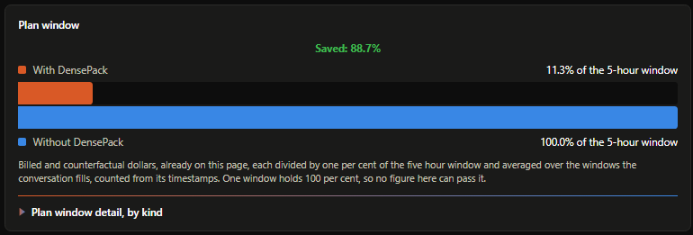
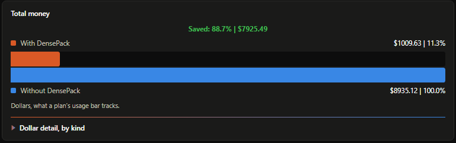
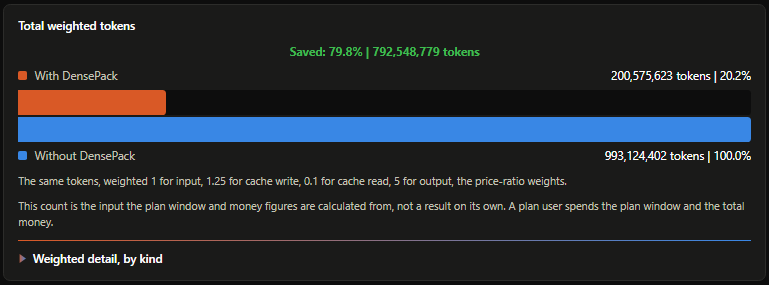
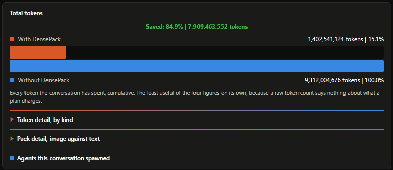
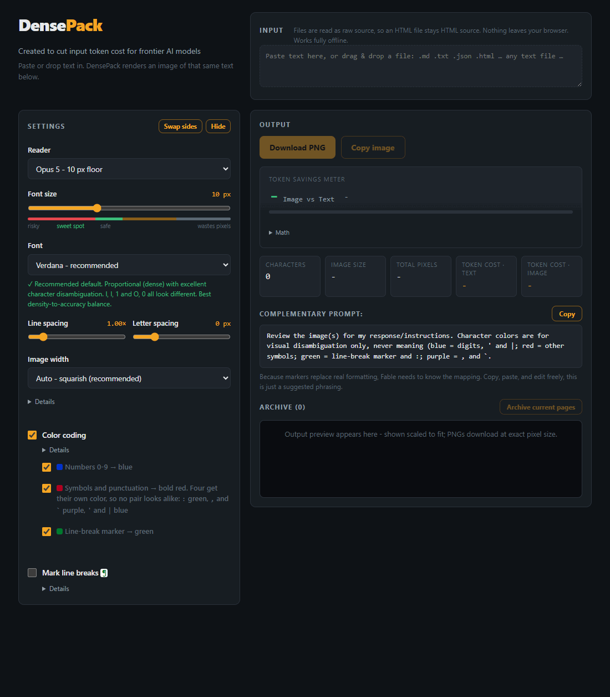

<p align="left">
  
</p>

<p align="center">
<strong>The DensePack plugin was built to save across entire conversations in Claude Code. <br>
Not just input or output savings. <br>
TOTAL.<br></strong>
</p>

<br>

<p align="center">
  <strong>56.5% Total savings across an entire conversation measured against a reproducible benchmark. 
  ~50% - 80% Total savings across entire long conversations, measured over 66 real conversations.</strong><br>
  <sub>Measured on real Claude Code sessions in this repo, not synthetic prompts. Priced at 2.40 characters a token, measured with Anthropic's count_tokens endpoint. 48 of 66 conversations saved over half of what they packed; of the 40 that packed five or more things, 38 did, with a median of 73%. The best conversation reached 88.7%; <a href="bench/results/BENCHMARK.md">Benchmark</a> &middot; <a href="bench/results/BENCHMARK.md">Reproduce it</a></sub>
</p>

| Runs on | Windows, Linux, macOS |
| --- | --- |

<br>


---


<br>

## Numbers

| Test                               | Input tokens | Dollars | Answer correct | Tokens saved against test 3 | Tokens saved per cent | Dollars saved against test 3 | Dollars saved per cent |
| ---------------------------------- | ------------ | ------- | -------------- | --------------------------- | --------------------- | ---------------------------- | ---------------------- |
| 1, plugin on, default              | 95,729       | 0.5152  | 4 of 4         | 143,678                     | 60.0                  | 0.6687                       | 56.5                   |
| 2, plugin off, delegated           | 192,692      | 0.9535  | 4 of 4         | 46,715                      | 19.5                  | 0.2304                       | 19.5                   |
| 3, plugin off, plain, the baseline | 239,407      | 1.1839  | 4 of 4         | 0                           | 0.0                   | 0.0000                       | 0.0                    |


>  DensePack achieves these savings by packing raw text into condensed images that vision capable AI models read without errors. 
>  The images costs between 50-75% less input tokens than raw text input.

<br>

## Live measurement of my best conversation savings

My best savings, recorded live and measured against Anthropic's `count_tokens` endpoint.

### Plan window


<br>

| Plan window                 | With DensePack | Without DensePack | Saved |
| --------------------------- | -------------- | ----------------- | ----- |
| input_tokens                | 0.0%           | 0.0%              | 0.0%  |
| cache_creation_input_tokens | 1.9%           | 2.1%              | 0.2%  |
| cache_read_input_tokens     | 8.3%           | 96.8%             | 88.5% |
| output_tokens               | 1.1%           | 1.1%              | 0.0%  |
| TOTAL                       | 11.3%          | 100.0%            | 88.7% |

<br>

### Total money


<br>

| Token money                 | With DensePack | %      | Without DensePack | %      | Saved    | %     |
| --------------------------- | -------------- | ------ | ----------------- | ------ | -------- | ----- |
| input_tokens                | $0.08          | 0.0%   | $0.08             | 0.0%   | $0.00    | 0.0%  |
| cache_creation_input_tokens | $168.59        | 16.7%  | $186.01           | 2.1%   | $17.42   | 9.4%  |
| cache_read_input_tokens     | $738.30        | 73.1%  | $8646.37          | 96.8%  | $7908.07 | 91.5% |
| output_tokens               | $102.65        | 10.2%  | $102.65           | 1.1%   | $0.00    | 0.0%  |
| TOTAL                       | $1009.63       | 100.0% | $8935.12          | 100.0% | $7925.49 | 88.7% |

<br>

### Total weighted tokens


<br>

| Token weighted tokens       | With DensePack | %      | Without DensePack | %      | Saved       | %     |
| --------------------------- | -------------- | ------ | ----------------- | ------ | ----------- | ----- |
| input_tokens                | 21,804         | 0.0%   | 21,804            | 0.0%   | 0           | 0.0%  |
| cache_creation_input_tokens | 40,172,989     | 20.0%  | 41,914,754        | 4.2%   | 1,741,765   | 4.2%  |
| cache_read_input_tokens     | 136,561,711    | 68.1%  | 927,368,725       | 93.4%  | 790,807,014 | 85.3% |
| output_tokens               | 23,819,120     | 11.9%  | 23,819,120        | 2.4%   | 0           | 0.0%  |
| TOTAL                       | 200,575,623    | 100.0% | 993,124,402       | 100.0% | 792,548,779 | 79.8% |

<br>

### Total tokens


<br>

| Total tokens                | With DensePack | %      | Without DensePack | %      | Saved         | %     |
| --------------------------- | -------------- | ------ | ----------------- | ------ | ------------- | ----- |
| input_tokens                | 21,804         | 0.0%   | 21,804            | 0.0%   | 0             | 0.0%  |
| cache_creation_input_tokens | 32,138,391     | 2.3%   | 33,531,803        | 0.4%   | 1,393,412     | 4.2%  |
| cache_read_input_tokens     | 1,365,617,105  | 97.4%  | 9,273,687,245     | 99.6%  | 7,908,070,140 | 85.3% |
| output_tokens               | 4,763,824      | 0.3%   | 4,763,824         | 0.1%   | 0             | 0.0%  |
| TOTAL                       | 1,402,541,124  | 100.0% | 9,312,004,676     | 100.0% | 7,909,463,552 | 84.9% |


<br>

---

<br>

## Setup

Three applications, one packing engine.

| Tool                                                                                            | Size     | Description                                                                                                                                                                                                   | Use                                                                        |
| ----------------------------------------------------------------------------------------------- | -------- | ------------------------------------------------------------------------------------------------------------------------------------------------------------------------------------------------------------- | -------------------------------------------------------------------------- |
| [Claude Code plugin](plugin/)<br><br>8 hook events, 14 commands                                 | 1,449 KB | Packs reports, briefs, Bash output, file reads and rules pages with nothing typed<br><br>Agents send each other pictures instead of text, so multi-agent work costs less                                                       | Two commands in Claude Code, below                                         |
| [Live GitHub page](https://github.com/Fabian-Galvez/DensePack)<br><br>[Single HTML file](index.html) | 113 KB   | Paste text into the Input box and the picture draws live<br><br>Copy it, or download the PNG and paste it into any chat                                                                                       | Open the live page<br><br>or download [index.html](index.html) and open it |
| [Right-click tool](tools/)<br><br>Windows shell entry                                           | 217 KB   | Turns a file or highlighted text into a picture from the shell menu<br><br>`Ctrl + Shift + D` replaces the highlighted text with the picture<br><br>`Ctrl + Shift + C` copies the picture and leaves the text | Download the [tools](tools/) folder<br><br>and run `install-densepack.bat`<br><br>Linux and macOS installs: [tools/README.md](tools/Tool-README.md) |

<br>

---

<br>

## Requirements

| Tool             | Requirements                                               | Installed on first run                                       |
| ---------------- | ---------------------------------------------------------- | ------------------------------------------------------------ |
| Plugin           | Claude Code, Python 3.8 or newer, Pillow                   | Pillow (and Python if its not installed already)             |
| Browser app      | A browser                                                  | Nothing                                                      |
| Right-click tool | Windows 10 1809 or newer, Python, Pillow and AutoHotkey v2 | Python, Pillow and AutoHotkey v2, by `install-densepack.bat` |

> <strong>DensePack sends nothing it packs anywhere.</strong> 
> It runs completely locally and offline after install. 

<sub>The plugin downloads the Pillow library on first run, and the right-click tool's installer downloads
Python, Pillow and AutoHotkey if they are not already installed.</sub>

<br>

---

<br>

## DensePack Plugin 


The plugin installs with two commands in Claude Code.

```
/plugin marketplace add Fabian-Galvez/DensePack
/plugin install densepack@densepack-marketplace
```

<br>

### Plugin commands

The plugin adds 14 slash commands. `/setpack` reaches every setting,
and `/helppack` prints every command with what it sets.

13 of them reach the model on the command list every session, at 1,272
characters and 530 tokens. The list was 25 commands, 2,178 characters
and 908 tokens until 31 August 2026, when twelve commands that each
set a single value were folded into `/setpack`.

| Group         | Commands                                   | Description                                                                                                                                        |
| ------------- | ------------------------------------------ | -------------------------------------------------------------------------------------------------------------------------------------------------- |
| Packing       | `/densepack`, `/densepack-off`, `/dpack`   | Turns every hook on or off and resets plugin to default settings                                                                                   |
| Type size     | `/opuspack`, `/fablepack`                  | 10 px for an Opus 5 lead, 8 px for a Fable 5 lead. The plugin reads the lead's model on its own                                                    |
| Receipts      | `/quietpack`                               | Whether the savings table prints in the reply at all. Its shape is a `/setpack receipts` argument, and the numbers are on the dashboard either way |
| Delegation    | `/agentpack`, `/agentpack-off`, `/maxpack` | Whether DensePack's delegation rules win, and whether an Opus 5 lead may spawn Fable 5 workers                                                     |
| Writing rules | `/stylepack`, `/stylepack-off`             | Whether the writing rules ride on the reminder that goes before each message                                                                       |
| Any setting   | `/setpack`, `/helppack`                    | Takes an option and a value and sets that one thing, and prints the table of every option                                                          |
| Self-check    | `/tune`                                    | Counts what this session's DensePack records show, and names the command that fixes each count                                                     |

<br>

### How DensePack works

| Step     | Description                                                                                                                                                     |
| -------- | --------------------------------------------------------------------------------------------------------------------------------------------------------------- |
| Draw     | The text goes into a monospace picture. Letters are black, digits are blue, symbols are red, and a green mark ends each line                                    |
| Size     | The type size follows the model that reads it. Fable 5 reads down to 8 px, Opus 5 to 10 px, Sonnet 5 to 12 px                                                   |
| Check    | The plugin counts the text and the picture, and passes the text through unchanged when the picture would cost more                                              |
| Protect  | An id, a hash, a file name or a comma grouped number never goes into the picture. A short tag stands in its place and the exact value travels as text beside it |
| Point    | The message carrying the picture names the .txt holding the exact bytes, so a reader can get any value back character for character                             |
| Delegate | The lead sends each job to the cheapest model that can do it, and reads the answer back as one picture                                                          |

<br>

### Questions

| Question                                                      | Answer                                                                                                                  |
| ------------------------------------------------------------- | ----------------------------------------------------------------------------------------------------------------------- |
| What Anthropic models does this work for?                     | Fable, Opus and Sonnet read the pictures, at 8, 10 and 12 px. Haiku works too and always receives text                  |
| Does the model read the picture exactly?                      | On the accuracy test both sides answered 60 of 60 questions character for character, with the plugin off and with it on |
| Does anything make external calls?                            | No. The packing runs on your machine. On first run the plugin installs Python and Pillow if they are missing, and the right-click tool's installer does the same plus AutoHotkey |
| What happens when the picture would cost more than the words? | The plugin passes the text through unchanged and logs the reason                                                        |

<br>

---

<br>

## Browser app




<p align="center">
  <sub><a href="https://github.com/Fabian-Galvez/VtG">Made with VtG</a> &middot; <a href="https://github.com/Fabian-Galvez/VtG/blob/main/GIFS.md">All VtG GIFS</a></sub>
</p>

<br>

# How to use the browser app

| Control      | Description                                                                         |
| ------------ | ----------------------------------------------------------------------------------- |
| Input        | Paste text, or drop a file. The picture redraws as you type                         |
| Reader       | Picks the type size. Fable 5 reads down to 8 px, Opus 5 to 10 px, Sonnet 5 to 12 px |
| Font size    | Smaller is cheaper and harder to read. The bar under it marks the sweet spot        |
| Color coding | Colors the look-alike pairs, 1 against l and 0 against O                            |
| Swap sides   | Puts the settings on the other side                                                 |
| Hide         | Hides the settings so your text takes the full width                                |
| Download PNG | Saves the picture. Paste it into a chat instead of the text                         |

<br>

---

<br>

## More

| Link                                             | Contents                                                                                          |
| ------------------------------------------------ | ------------------------------------------------------------------------------------------------- |
| [bench/](bench/)                                 | Every test that has to pass before a change lands                                                 |
| [bench/results/BENCHMARK.md](bench/results/BENCHMARK.md)         | The report figure and the session figure, what each measures, and the command that re-measures it |
| [plugin/PARTS.md](plugin/PARTS.md)               | Every file the plugin ships and what makes it run                                                 |
| [plugin/README.md](plugin/README.md)             | The hook events, the 14 commands, and what each one changes                                       |
| [MATH.md](MATH.md)                               | The seven paired runs, the accuracy test, and how to re-measure both                              |
| [tools/README.md](tools/Tool-README.md)               | The right-click tool, its flags and its registry change                                           |
| [THIRD-PARTY-NOTICES.md](THIRD-PARTY-NOTICES.md) | Pillow                                                                                            |
| [LICENSE](LICENSE)                               | MIT                                                                                               |
