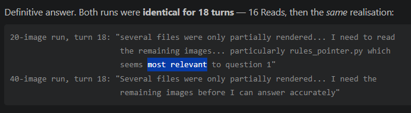
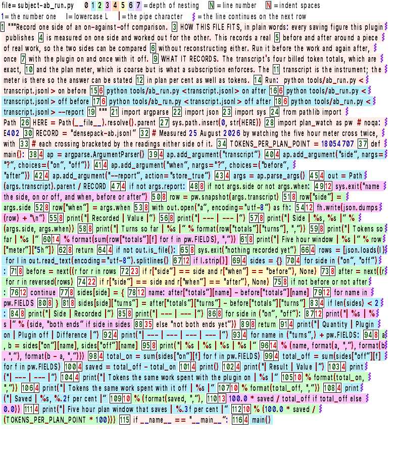

<p align="left">
  
</p>

<p align="center">
DensePack packs raw text into the smallest possible image that an AI model can read accurately. Packed images average 50% fewer input tokens than their raw text counterpart.<br>
<br>
<br>
Each later turn re-reads the files as cheaper images, so a longer session saves more.<br>
DensePack is built for conversations that read many files, such as auditing a repository by reading its files as images.<br>
<strong>DensePack's floor is 22.0% to 27.5% total conversation savings on a single file. Not just input tokens.</strong>
</p>


<p align="center">
  <sub>Rebuilt from DirectWrite to FreeType, so it runs on Windows, Linux and macOS. Tested on Windows and Linux.</sub>
</p>


---
> <details>
> <summary><strong>Table of Contents</strong></summary>
> 
> - [Benchmarks - Total conversation savings](#benchmarks---total-conversation-savings)
> 	- [Each pair](#each-pair)
> 	- [Install the plugin to recreate the benches](#install-the-plugin-to-recreate-the-benches)
> - [DensePack's three parts](#densepacks-three-parts)
> 	- [Install the plugin](#install-the-plugin)
> 	- [Work for the most savings](#work-for-the-most-savings)
> 	- [What DensePack changes](#what-densepack-changes)
> 	- [Install the right-click tool](#install-the-right-click-tool)
> 	- [Use the HTML app](#use-the-html-app)
> - [How DensePack plugin saves](#how-densepack-plugin-saves)
> 	- [Where DensePack started](#where-densepack-started)
> 	- [DensePack saves even when it takes more turns](#densepack-saves-even-when-it-takes-more-turns)
> 	- [What a file costs, message by message](#what-a-file-costs-message-by-message)
> 	- [A real session](#a-real-session)
> - [How the swap happens](#how-the-swap-happens)
> - [Packing is not a rare event](#packing-is-not-a-rare-event)
> - [Limits](#limits)
> 	- [How Anthropic bills](#how-anthropic-bills)
> - [The image](#the-image)
> - [Paths](#paths)
> - [Exact values](#exact-values)
> - [Thank you](#thank-you)
> - [Files](#files)
</details>

<br>
<br>

---

<br>

## Benchmarks - Total conversation savings

> These are the total conversation savings for the single-file, 16-file and 32-file bench On/Off pairs.
> <strong>On the 32-file bench, DensePack cuts the cost of the whole conversation by 70.4% to 73.3%.</strong>
> <sub>That bench is a small task. 32 files read in 4 turns is about $2.82 on Opus 5 with DensePack off.</sub><br><br>
> Fable 5.1, Opus 5, and Sonnet 5 were each benched with the DensePack plugin On against a baseline text arm with DensePack plugin Off. 
> 
> All arms run isolated and are given the same task, read files and answer questions about them, with the only difference being that the On arm reads DensePack images instead of the raw text.
><br>
<sub>The 32-file and 16-file figures are at the cold price. The single-file figures are as billed, and both arms started with the same cache. All arms answered all 5 questions correctly.<br>
<a href="BENCHMARKS.md">BENCHMARKS.md</a> holds more information.</sub><br>
<br>

#### Where the numbers come from

Every price comes from the token counts the Anthropic API returned for each message of the arm.<br>
Claude Code writes those counts into the arm's transcript, `~/.claude/projects/<folder>/<session id>.jsonl`, under `usage`.<br>
The bench adds up `input_tokens`, `cache_creation_input_tokens`, `cache_read_input_tokens` and `output_tokens`, and multiplies them by Anthropic's published prices.<br>
The billed price is `total_cost_usd`, the dollar figure Claude Code reports for the arm.<br>
The token columns come from DensePack's own record, `.claude/tmp/densepack-manifest.jsonl`, in the bench folder.<br>
<br>


<br>


| Model                      | 32-file bench | 16-file bench | Score  | Runs    |     | Single-file bench | Score  | Runs |
| -------------------------- | ------------- | ------------- | ------ | ------- | --- | ----------------- | ------ | ---- |
| <strong>Fable 5.1</strong> | 71.1%         | 65.2%         | 5 of 5 | 3 pairs |     | 22.0%             | 5 of 5 | 100  |
| <strong>Opus 5</strong>    | 73.3%         | 65.2%         | 5 of 5 | 3 pairs |     | 27.5%             | 5 of 5 | 100  |
| <strong>Sonnet 5</strong>  | 70.4%         | 31.5%         | 5 of 5 | 3 pairs |     | 27.4%             | 5 of 5 | 100  |

### Each pair

| Reader    | Bench   | Pair 1 | Pair 2 | Pair 3 | Pair 4 |
| --------- | ------- | ------ | ------ | ------ | ------ |
| Fable 5.1 | 32-file | 71.1%  | 71.1%  | 71.1%  |        |
| Fable 5.1 | 16-file | 64.6%  | 65.2%  | 68.9%  |        |
| Opus 5    | 32-file | 75.3%  | 73.3%  | 70.2%  | 75.3%  |
| Opus 5    | 16-file | 64.7%  | 65.4%  | 65.2%  | 63.4%  |
| Sonnet 5  | 32-file | 72.7%  | 70.4%  | 29.9%  | 72.9%  |
| Sonnet 5  | 16-file | 59.3%  | 31.5%  | 25.8%  | 27.2%  |
<br>

> [!NOTE]
> One big find while using DensePack is that models are able to stop ingesting data if they have found the answers they need while the text arm has no choice but to read everything. Sonnet's savings for the 32 and 16-file benches vary because of this. 
> 
> When DensePack is on and the models use the Read tool, the agent decides how it'll batch the images. This allows the agent to stop partway between batches or pull only the image they need between batches. 
> 
> Sonnet chose to guess and pull only the necessary image based on what it had already read, and the line number mentioned in the task's question. It only chose to do this for half of the benches which is how it achieved the 59.3% savings in the 16-file bench and the 72.7% and 70.4% in the 32-file benches. Opus and Fable chose to guess every time and chose the correct file every time then stopped. This is why they have consistent savings. Fable's savings for the 32-file came back identical, down to the decimal point.
<br>


<p align="center">

</p>

<p align="center">
<sub>The two runs were the same for 18 turns then one chose to select and read 4 images while the other On arm read all 24. They both got all 5 answers correct.<br>
</sub>

</p>

<br>

---

<br>

### Install the plugin to recreate the benches

Install the DensePack plugin to [recreate the benches](bench/RUN-THE-BENCHES.md).

<br>

---

<br>

## DensePack's three parts

DensePack plugin, right-click tool, and HTML app all pack images.
<br>
The HTML app is still running its original renderer. It packs plain text into legible images, but it does not have the colour coding that makes a code file readable.
<br>

| Part                 | What it does                                                                                                                  | Who it is for                                         | Where to start                               |
| -------------------- | ----------------------------------------------------------------------------------------------------------------------------- | ----------------------------------------------------- | -------------------------------------------- |
| **Plugin**           | Automatic packing inside Claude Code. <br><br>Two commands to install.<br>Simple commands to run the benches.                 | Anyone using Claude Code                              | [Install the plugin](#install-the-plugin)    |
| **Right-click tool** | Pack highlighted text or a file from your shell or file manager                                                               | Anyone using any AI chat                              | [tools/Tool-README.md](tools/Tool-README.md) |
| **HTML app**         | Runs in your browser. <br><br>Paste text in and the image renders live.<br>Download or Copy to take with you.<br><br><br><br> | Anyone who wants one image prompt without an install. | [Open the HTML app](#use-the-html-app)       |

<br> 

---

<br>

### Install the plugin

<a href="INSTALL.md">INSTALL.md</a> has every step for Windows, macOS and Linux.<br>


```
/plugin marketplace add Fabian-Galvez/DensePack
/plugin install densepack@densepack-marketplace
```

<br>
<br>

On Windows the first run installs <strong>Python</strong> with winget if it is missing. On macOS and Linux the plugin prints the command that installs Python. The plugin then installs <strong>Pillow, freetype-py and NumPy</strong> into its own data folder.
<br>
On Windows the hooks run through Git Bash, or through PowerShell when Git for Windows is not installed.
<br>

| System  | Python                                                          | Pillow, freetype-py and NumPy             |
| ------- | --------------------------------------------------------------- | ----------------------------------------- |
| Windows | winget installs Python 3.13 for your user, with no admin rights | pip puts them in the plugin's data folder |
| macOS   | Nothing. The plugin prints the brew command for you to run  | pip puts them in the plugin's data folder |
| Linux   | Nothing. The plugin prints the sudo command for you to run      | pip puts them in the plugin's data folder |
<br>

- The plugin tries the Python install once per machine. <strong>Restart Claude Code after Python installs.</strong> 
- Update from a terminal with `claude plugin marketplace update densepack-marketplace`, then `claude plugin update densepack@densepack-marketplace`. 
- Restart Claude Code after.
<br>
Uninstall with `/plugin uninstall densepack`.
The install also keeps a copy of this repository. `/plugin marketplace remove densepack-marketplace` deletes that copy.
<br>
<br>

| Command                      | Function                                                                                                                                                                                                                                                        |
| ---------------------------- | --------------------------------------------------------------------------------------------------------------------------------------------------------------------------------------------------------------------------------------------------------------- |
| `/densepack`                 | Turns DensePack on/puts every setting back to DensePack's default                                                                                                                                                                                               |
| `/dense-off`                 | Stops every DensePack hook for this session only. A new session starts with DensePack on                                                                                                                                                                        |
| `/maxpack`                   | Sends Sonnet images. This is the default                                                                                                                                                                                                                        |
| `/max-off`                   | Sends Sonnet text                                                                                                                                                                                                                                               |
| `/helppack`                  | Prints every command                                                                                                                                                                                                                                            |
| `/dense-remove`              | Puts every converted `CLAUDE.md`, `CLAUDE.local.md` and `MEMORY.md` back to its original text, removes `CLAUDE_CODE_THRIFTY_SONIC`, and deletes every DensePack file that `/plugin uninstall` leaves behind. Run it before the uninstall                        |
| `/mdpack <folder>`           | Converts that folder's `CLAUDE.md`, `.claude/CLAUDE.md` and `CLAUDE.local.md` into images behind a pointer, without reading them. Run it from a folder next to that folder, then open a new session inside it. That session reads the images and never the text |
| <strong>Coming Soon</strong> |                                                                                                                                                                                                                                                                 |
| /agentpack                   | Agent spawning and delegation that complements DensePack. Keeps context out of the main agent's context window. The main agent receives subagent reports as images. Initial tests are promising and show an additional 15% savings added to floor on delegated tasks. |
| /dashpack                    | Dashboard showing live per conversation savings. Calculates what the images the agents have received would have cost them to read as text with compounding effect.                                                                                              |

<br>

### Work for the most savings

DensePack saves the most in long conversations that read many files, such as auditing a repository.
A short session that mostly runs commands saves little, because only file reads become images.

**A repository that already has a `CLAUDE.md`:**

1. Start Claude Code in a folder next to the repository, not inside it. Claude Code does not load the repository's `CLAUDE.md` there.
2. Run `/mdpack <path to the repository>`. DensePack converts the repository's `CLAUDE.md` into images behind a pointer, and the agent reads none of it.
3. Exit, and start a new session inside the repository. Its first session loads the pointer and reads the images. The text is never sent.

**Auditing or reading a repository:**

1. Start Claude Code in an empty folder outside the repository.
2. Point the agent at the repository. Every file it reads comes back as images.
3. This is how the benches ran.

**In every session:**

- Read files with the Read tool. A Bash read (`cat`, `head`, `sed`, `type`) is packed too, but it takes an extra turn, so the file has to be bigger before it saves.
- Keep working in the same session. Each later turn reads the images again at the cheaper size, so the saving grows with the conversation.
- Your `~/.claude/CLAUDE.md` and each project's `MEMORY.md` convert on their own at session start. The session that converts them still sends their text once.

### What DensePack changes

DensePack changes three things that are yours, and adds folders and packages of its own.

The slash command `/dense-remove` undoes all of them.

| What it changes                                                                                                                                  | What DensePack does                                                                                                                                                                                                                           | Why                                                                                                                                                                                                    |
| ------------------------------------------------------------------------------------------------------------------------------------------------ | --------------------------------------------------------------------------------------------------------------------------------------------------------------------------------------------------------------------------------------------- | ------------------------------------------------------------------------------------------------------------------------------------------------------------------------------------------------------ |
| `CLAUDE.md`, `.claude/CLAUDE.md` and `CLAUDE.local.md` in a project, your `~/.claude/CLAUDE.md`, and the project's auto memory index `MEMORY.md` | At session start, it copies the file to `<name>.densepack.bak`, converts the text into images, and replaces the file with a short pointer that names every image. It converts a file only when the images and pointer cost less than the text | Claude Code sends these files as text on every call. As images they cost about half                                                                                                                    |
| `~/.claude/settings.json`                                                                                                                        | Adds `"CLAUDE_CODE_THRIFTY_SONIC": "0"` to the `env` block, once, when the key is not there                                                                                                                                                   | Auto mode tells the agent to read files with Bash, and a Bash read takes an extra turn, so it saves less than a Read                                                                                                              |
| A `.gitignore` in `.claude/tmp/` and `.claude/densepack-vault/`                                                                                  | Writes one line, `*`                                                                                                                                                                                                                          | Those folders hold copies of your files and command output, so they stay out of your commits                                                                                                           |
| `~/.claude/densepack-state`                                                                                                                      | Creates the folder. Contains the location of the Python it found, and one folder per project                                                                                                                                                  | DensePack trusts its own notes about what it already converted. A repository you clone can contain a fake copy of those notes, so they are kept in your home folder, where a clone cannot put anything |
| `~/.claude/densepack-cards`                                                                                                                      | Creates the folder. Contains the rendered legend cards, one folder per card                                                                                                                                                                   | Without it, every new project draws the whole card set from nothing, which takes minutes at session start                                                                                              |
| Pillow, freetype-py and NumPy                                                                                                                    | Installs them with pip into the plugin's own data folder, once                                                                                                                                                                                | DensePack needs all three to render an image. Your own Python is untouched and no password is asked for                                                                                                |

#### How the conversion works

- Claude Code loads `CLAUDE.md`, `.claude/CLAUDE.md` and `CLAUDE.local.md` in a project, your `~/.claude/CLAUDE.md`, and the project's auto memory index `MEMORY.md` before DensePack runs.
  If you start in a folder that holds one of these, the conversion happens after Claude Code has already read that file as text and cached it.
  To get around this, run `/mdpack <folder>` from an empty folder next to the folder with the files. That converts them without reading them as text first. You can then start Claude Code in that folder, and it reads the short text pointer and the images instead of the raw text.
- Each converted file becomes three files: the pointer, the `.densepack.bak` and the images.
- The `.bak` holds your original text, byte for byte. Claude Code does not load it, because of its name.
- A file converts only when its images and pointer cost less than its text. A short file stays text.
- Reading the images can take one extra call at the start of a session. A large `CLAUDE.md` repays it within a few calls. A small file that converts alone, such as a short `MEMORY.md`, may not repay it in a short session.
- To change your instructions, edit the `.bak`. DensePack converts it again at the next session start.
- Text added below the pointer moves into the `.bak` at the next session start. New lines from auto memory move the same way.
- If you replace a pointer with a new file, the new file is converted and the old `.bak` stays as `.densepack.bak.old-1`.
- A Haiku session reads the `.bak` as text, because DensePack sends Haiku text.
- Auto memory keeps working. DensePack sets no flag that turns memory off.
- In a shared repository, commit the `.bak` with the pointer. A teammate without DensePack reads the `.bak`.

#### Files and folders DensePack writes

| File or folder                                                | What is inside it                                                                                               |
| ------------------------------------------------------------- | --------------------------------------------------------------------------------------------------------------- |
| `~/.claude/densepack-cards/`                                  | Images the plugin reuses between sessions                                                                       |
| `.claude/tmp/` and `.claude/densepack-vault/` in each project | Working files and converted images, including the images of the project's `CLAUDE.md` in `instruction-images/` |
| `~/.claude/densepack-state/`, or the plugin's data folder     | The last session's savings table, the style file, the key that seals image and queue records, the list of converted instruction files, and the images of your user `CLAUDE.md` and memory index |

<sub>DensePack packs and saves everything to your computer. None of these files leaves your machine. Run `/dense-remove` before you uninstall.</sub>

<br>

---

<br>

### Install the right-click tool

The right-click tool is made of files from this repository, so you need a copy of them on your computer.

<strong>If you installed the plugin</strong>, you already have them, in this folder:

- Windows: `%USERPROFILE%\.claude\plugins\marketplaces\densepack-marketplace`
- macOS and Linux: `~/.claude/plugins/marketplaces/densepack-marketplace`

<strong>If you did not install the plugin</strong>, click the green **Code** button at the top of this page, choose **Download ZIP**, and unzip it.

<strong>Open the `tools` folder inside it and start the installer.</strong>

| Your computer | What to do                                                       |
| ------------- | ---------------------------------------------------------------- |
| Windows       | Double-click `install-densepack.bat`                             |
| macOS         | Double-click `DensePack it.workflow`                             |
| Linux         | Open a terminal in that folder and run `sh install-densepack.sh` |

The installer does the rest. [tools/Tool-README.md](tools/Tool-README.md) says what it changes, how to skip the hotkeys and the reading card, and how to uninstall.
<br>
<sub>The right-click tool needs this repository on your machine, but you do not need Claude Code or the plugin.</sub>

<br>

---

<br>

### Use the HTML app

Download [index.html](index.html) from this repository and open it in any browser.
It needs no install and it makes the images in your browser.
Paste a file, watch the token count fall, and download the image or copy it
to paste into any AI chat.

| Control                        | What it changes                                                               |
| ------------------------------ | ----------------------------------------------------------------------------- |
| Reader                         | Picks the type size for the model that will read the image                    |
| Width                          | Auto picks a near-square image shape. 1024, 1536 and 1932 px set it by hand   |
| Type                           | The glyph size, the line height and the letter spacing                        |
| Code mode                      | Produces the banded code image instead of plain prose                         |
| Colours                        | The number ink, the symbol ink and the mark ink                               |
| Download PNG, Copy image, Copy | Saves the image, puts it on the clipboard, or copies the Complementary Prompt |

The HTML app uses its own renderer and prints a pilcrow at each line end
where the plugin prints a line number. 

<br>

---

<br>

## How DensePack plugin saves

AI agents tokenize your input (messages, files, reports from subagents, etc). Those tokens are billed, written to cache, and compound your context. 
<br>
<strong>DensePack shrinks your input before it goes into context.</strong>
<br>

- DensePack images cost **31 to 55%** compared to raw text input.
- You pay cache write **once**, on the 31 to 55%.
- Every later turn pays cache read on that same 31 to 55%, at .1x, or .025x
  for Fable 5.1.
<br>
When your agent needs to read a text file, the DensePack plugin replaces it with an image. 
Your agent reads and caches the image instead. 
<br>
Smaller cache writes lead to smaller cache reads which compound much slower without ever having to trim, or compress the data that you send.
The longer you work, the more DensePack saves.


<br>

---

<br>

### Where DensePack started

DensePack saved input tokens from the start, and it still lost money on small tasks.
The images caused extra turns and long thinking, and output bills at 5x.
DensePack now saves on a single file.

The tables above hold the most recent benches.

<br>

---

<br>

### DensePack saves even when it takes more turns

Every turn re-reads the whole conversation from the cache. 
An image costs fewer tokens than its text, so every later turn re-reads less. 
An extra turn re-reads that smaller cache at 0.1x the input price, or 0.025x on Fable 5.1. 
So the image arm can take more turns and still cost less. 

In Sonnet 5 pair `sonnet-thirtytwo-1`, the image arm took 6 turns and the text arm took 4. 
Both arms answered 5 of 5, and the image arm cost 60.5% less. 
In Sonnet 5 pair `sonnet-thirtytwo-v26-check-2`, the image arm took 8 turns and the text arm took 4. 
That pair ran an earlier 32-file task with 10 questions. 
Both arms answered 10 of 10, and the image arm cost 78.2% less. 

<strong>The image arm sometimes reads less than the text arm.</strong>

It opens only the images it needs, and the text arm reads every file in full.

<br>

---

<br>

### What a file costs, message by message

Each message sends one 1,000 token file.
A 1-hour cache write costs 2x the input price, and a cache read costs 0.1x.
DensePack packs each file into an image of 500 tokens, with nothing trimmed
and nothing compressed.

| Message         | Without DensePack                | With DensePack                 |
| --------------- | -------------------------------- | ------------------------------ |
| 1               | write 1,000 at 2x = 2,000        | write 500 at 2x = 1,000        |
| 2               | read 1,000 + write 1,000 = 2,100 | read 500 + write 500 = 1,050   |
| 3               | read 2,000 + write 1,000 = 2,200 | read 1,000 + write 500 = 1,100 |
| Total after 3   | 6,300                            | 3,150                          |
| Total after 10  | 24,500                           | 12,250                         |
| Total after 50  | 222,500                          | 111,250                        |
| Total after 100 | 695,000                          | 347,500                        |

The cache read grows with every message, because each message reads
everything before it.
DensePack halves every cache write, so it halves every cache read after it.

An agent often takes more than one turn for one prompt, and each turn is one
more cache read.
That is why the 32-file benches save more than half even if the image arm
takes twice the turns.

<br>

### A real session

A real Opus 5 working session with DensePack on made 84 model calls and read 6 images.
Anthropic's count_tokens endpoint counted each image and the exact text it replaced.

- Read once, the images cost 43.9% less than the same lines as Bash text, and 52.0% less than Read text.
- Carried on every later call, the images sent 409,421 tokens where Bash text sends 732,708 and Read text sends 858,493.
- The images needed one extra call to fetch a file's later images.
- With that call counted, the images saved **33.2%** against Bash text and **43.0%** against Read text.

<sub>These are token counts, not prices. [BENCHMARKS.md](BENCHMARKS.md#real-session-16-september-2026) holds the full measure.</sub>

<br>

---

<br>

## How the swap happens

The swap happens automatically, before the tool runs.

1. The agent decides to read a file and calls the Read tool.
2. A hook fires **before** the read happens.
3. The hook converts that file into a dense image and swaps the file path for
   the image path.
4. The agent receives the image instead of the text. It reads it normally.

The same swap runs on shell output. When a Bash command prints a long wall
of text:
1. A hook rewrites the command before it runs.
2. The command writes its output to a file.
3. The hook renders that file as an image.
4. The agent receives the image instead of the text.

A subagent gets its brief as an image, and it sends its report back as an image.

<br>

---

<br>

## Packing is not a rare event

DensePack packs files, command outputs, and the briefs and reports that travel to and from subagents.
Before every Read the plugin compares what the image costs with what the text costs.
It sends the text when the image would cost more.
A Read costs nothing extra, because the agent already called Read and the hook swaps the path before it runs.
A command costs one turn more than a Read: one turn to hand the agent the image, and another for the agent to read it.
A command's output also arrives wrapped in extra text from Claude Code.
The plugin counts that turn and that extra text in the comparison, which is why Read packs at 1,000 bytes and a command needs thousands.

| What gets packed                 | When                         |
| -------------------------------- | ---------------------------- |
| A brief being sent to a subagent | Before the subagent starts   |
| A subagent's report              | When the subagent finishes   |
| Read tool                        | Before the Read runs         |
| Long shell output                | Before the Bash command runs |

| File type                                        | Reads as an image                                                               |
| ------------------------------------------------ | ------------------------------------------------------------------------------- |
| Text with accents, dashes, Greek and maths signs | Yes                                                                             |
| Prose: reports, briefs, shell output             | Yes. Agents communicate with each other with images of their reports and briefs |
| Python `.py`                                     | Yes. <br><br>Opus rebuilt 99.8% of the characters or more. Fable scored 99.83%  |
| HTML `.html`                                     | Yes. Byte identical rebuild on Opus. Fable 99.99%                               |
| Markdown `.md`                                   | Yes. Rebuilt with every word on Opus and Fable                                  |
| Go `.go`, indented with tabs                     | Yes. <br><br>Fable scored 99.97%. Opus scored 99.93%. Sonnet scored 99.72%. All three rebuilt every tab as a tab |
| Markdown with a wide table row                   | Not yet. The image costs more, so the plugin sends text.                        |
| Word `.docx` and `.doc`                          | Yes. Claude Code cannot open a Word file on its own. DensePack reads the words out and draws them, in the same turn as any other file. Up to 0.5 MB, [raise that here](INSTALL.md#the-size-ceiling) |
| JSON, CSV, YAML                                  | Not measured                                                                    |
| Haiku, any file                                  | No. Haiku gets text                                                             |
| Sonnet, any file                                 | Yes. Type `/max-off` to send Sonnet text                                         |
| Chinese, Japanese, Korean font                   | No. Only Inter font glyphs at the moment                                        |

<sub>Byte identical rebuild is not a real use case. This bench is only to show that the agents can rebuild different file types from DensePack images near perfectly. </sub>

<br>

---

<br>

## Limits

- Haiku hallucinates image text. It is never sent images, only text.
<br>
- Short conversations save less than long ones.
<br>
- Use the Edit tool to change a file that arrived as an image. The Write tool refuses that file.
  <sub>Your AI is told this at the start of every session.</sub>
<br>
  
- DensePack adds about 205 prompt tokens once a session.
  That is the list of its 5 commands and 1 skill. The hooks add nothing to the prompt.
  <sub>Measured with Opus 5, as the same two messages with DensePack off and on.</sub>
<br>

- A file over 250,000 bytes or 6,000 lines stays text. So does a file that holds a null byte.
  <br>
- A file in Chinese, Japanese or Korean stays text. So does a file full of box-drawing characters. The font has no glyphs for those characters.
  <br>
- On Windows without Git for Windows, the hooks run through a PowerShell script.
  Each hook then takes about 0.8 seconds, against about 0.2 seconds with Git.
  <sub>A company policy that blocks PowerShell scripts switches DensePack off on that computer.</sub>
<br>
- The HTML app uses its own renderer. The benches score the plugin's renderer.
  <sub>The right-click tool uses the plugin's renderer.</sub> 
<br>
- If a model struggles to read an image, it takes more turns and opens thinking blocks. 
  That means more output and a smaller saving, because Anthropic bills output at 5x. 
<br>
- Sonnet 5 sometimes answers a question wrong on the text run and on the image run alike.


<br>

---

<br>

### How Anthropic bills

Anthropic bills per million tokens (MTok), priced per model:

<strong>Cache read is 0.1x of the 1x base input price</strong>, not 0.1x the 2x cache creation price. 

| Model                      | `input_tokens` (1x) | `cache_creation` (2x) | `cache_read` (0.1x) | `output_tokens` (5x) |
| -------------------------- | ------------------- | --------------------- | ------------------- | -------------------- |
| <strong>Fable 5.1</strong> | $10                 | $20                   | $0.25 (0.025x)      | $50                  |
| <strong>Opus 5</strong>    | $5                  | $10                   | $0.50               | $25                  |
| <strong>Sonnet 5</strong>  | $2                  | $4                    | $0.20               | $10                  |

<sub>Rates are taken from the <strong>Model pricing</strong> table on <a href="https://platform.claude.com/docs/en/about-claude/pricing">Anthropic's pricing site</a>.</sub>


`input_tokens` is the baseline that the multipliers calculate against. 

`cache_creation_input_tokens` are `input_tokens` that get cached. 
 
Claude Code writes a 1-hour cache for the main conversation on a Pro or Max plan. 
It writes a 5-minute cache for subagents, and for everything on an API key. 
A 1-hour cache write costs 2x the base input rate of the model, and a 5-minute cache write costs 1.25x. 
The cache lets the model remember the conversation.
The model reads the whole cache at the `cache_read_input_tokens` 0.1x multiplier price.

<sub>Without caching on, you would be billed the base 1x price but the model would forget everything immediately after every message.</sub>

<br>

---

<br>


## The image

> One function, `pack_code()` in `plugin/scripts/codepack.py`, produces every image. 
> The image is the same PNG, 756 or 784 pixels wide, for every model. The renderer keeps the width that saves more.
<br>

<p align="center">

</p>
<br>

| Character ink color | Source file      |
| ------------------- | ---------------- |
| Black               | Letters          |
| Blue                | Digits           |
| Red                 | Most other marks |
<br>

| Color Code                      | Description                        |
| ------------------------------- | ---------------------------------- |
| A coloured band behind a row    | The nesting depth of each line     |
| A green number at the row start | The source file's line number      |
| A gap in the green numbers      | Blank lines                        |
| A red number after the green    | The line's indent, in spaces       |
| A purple mark at the right edge | The line continues on the next row |
| The top two rows of the image   | Color code legend                  |


This is the image the single file bench reads.

| The image above | Value |
| --- | --- |
| What it holds | Every character of `bench/single-1000-token-file/subject-ab_run.py` |
| Size of that file | 4,461 characters of Python |
| Pixels | 784 by 896 |
| Cost as an image | 896 visual tokens |
| Cost as text | 1,859 tokens |
| Score | Fable, Opus and Sonnet each answered 5 of 5 |

The font is Inter SemiBold. 
FreeType renders each character as a grey mask and Pillow writes the PNG. 
Letters are condensed to 10 of 17 of their width. 
Digits, brackets, the lowercase l and the comma are condensed to 12 of 17.

The API charges an image by patches of 28 by 28 pixels. 
A 784 by 896 image is 896 visual tokens. 
Text costs about one token per 2.4 characters. 
The plugin compares the two numbers for the file in hand and sends the text when the text is cheaper.

<br>

---

<br>

## Paths

| What you do                                             | What DensePack does                                                          |
| ------------------------------------------------------- | ---------------------------------------------------------------------------- |
| You Read a file over 1,000 bytes                        | The file arrives as one image                                                |
| You run a command that prints over 5,000 characters     | The output arrives as one image when it saves more than the extra turn costs |
| You start a subagent with a brief over 1,000 characters | The brief arrives as one image, before the subagent starts                   |
| A subagent finishes its report                          | The report arrives as one image                                              |
| You Edit a file that arrived as an image                | The edit works                                                               |
| You Write a file that arrived as an image               | The write fails                                                              |

> [!IMPORTANT]
> 
> Write fails because Claude Code makes the agent read the text first.
> A Read of that file gives the image again, and an image is not text.
> 
> Edit works, because the agent gives Edit the exact text it read off the image.

<br>

<strong>DensePack writes these folders:</strong>

| What                     | Folder                                                             |
| ------------------------ | ------------------------------------------------------------------ |
| The plugin               | ~/.claude/plugins/cache/densepack-marketplace/densepack/<version>/ |
| Images                   | <project>/.claude/densepack-vault/images/                          |
| Files to convert by hand | <project>/.claude/densepack-vault/to-draw/                         |
| Working files            | <project>/.claude/tmp/                                             |

Some Reads are never converted:
- Images, PDFs and notebooks. Claude Code already reads them as images or as structured cells.
- Anything under a .claude folder or a folder named sandbox or scratch. Those hold working files, including DensePack's own images.
- Files under 1,000 bytes, over 250,000 bytes, over 6,000 lines or holding a null byte. They are too small to save anything, too slow to convert, or not text.

<sub>One rule is model-specific. A Sonnet turn that asks for more than 32 packed files, or more than 700,000 bytes across them, gets text. Opus and Fable have no cap.</sub>

<br>

---

<br>

## Exact values

The reader takes a long number, a hash or a path from the image when it reads clean. 
When in doubt the reader pulls only that line from the text by its green line number in the image. 
It uses Read at offset N and limit 1. 
It never reads the whole text file.

A Read of 20 lines or fewer passes every DensePack hook untouched. 
`LINE_PULL_MAX` in `plugin/scripts/common.py` contains the 20 lines.

<br>

---

<br>

## Thank you

A font built for AI legibility and accuracy is on the agenda, but a long ways off.

DensePack plugin renders every character with [FreeType](https://freetype.org) and the [Inter](https://rsms.me/inter/) font family.<br>
Without them this project would have needed its own font from day one and the project may have stalled.
<br>

Thank you both.

<br>

---

<br>

## Files

| File                                             | What it covers                                                            |
| ------------------------------------------------ | ------------------------------------------------------------------------- |
| [README.md](README.md)                           | What DensePack is, what it saves, and how to install each part            |
| [plugin](#install-the-plugin)                    | The Claude Code plugin: its manifest, hooks, scripts, font and commands   |
| [tools/Tool-README.md](tools/Tool-README.md)     | The right-click tool: install, use, and the files it puts on your machine |
| [index.html](index.html)                         | The browser app                                                           |
| [bench/README.md](bench/README.md)               | The benches: how to run them, the results and the files they use          |
| [icon](icon)                                     | The DensePack icon files that the right-click tool uses                   |
| [images](images)                                 | The banner and the two charts in this file                                |
| [THIRD-PARTY-NOTICES.md](THIRD-PARTY-NOTICES.md) | The font and the libraries this project uses, with their licences         |
| [LICENSE](LICENSE)                               | MIT                                                                       |
