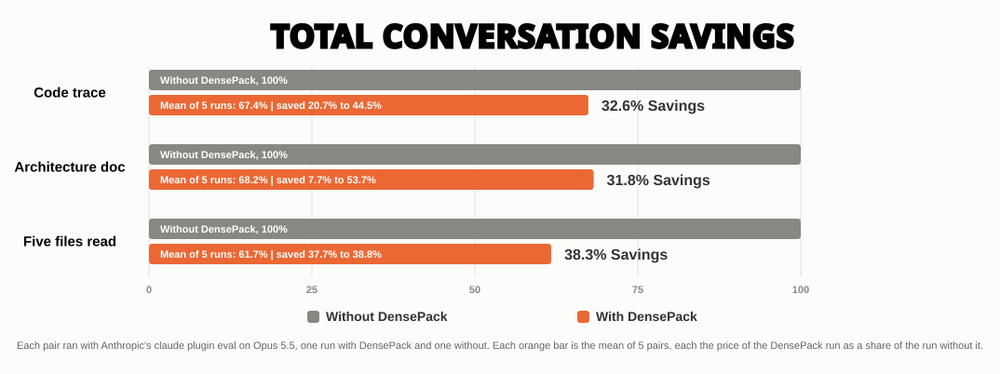

<!-- DensePack 1.3.2 -->
<p align="left">
  
</p>

<p align="center">
DensePack packs text into the smallest image that Fable, Opus and Sonnet models can read. The image uses about half the input tokens of the text.<br>
<br>
<strong>Anthropic's <code>claude plugin eval</code> ran three coding tasks on Opus 5.5. DensePack saved 31.8% to 38.3% of the price on average, and all runs passed their checks.</strong><br>
<br>
Turns are calls to the model that send the entire conversation that has been written to cache at cache read price.
</p>

<p align="center">
<sub>The DensePack plugin and the right-click tool render their images with FreeType and run on Windows, Linux and macOS. The tests ran on Windows and Linux.</sub>
</p>

---

<details>
<summary><strong>Contents</strong></summary>

- [Savings](#savings)
- [Parts](#parts)
- [Install the plugin](#install-the-plugin)
- [Save the most](#save-the-most)
- [Changes to your computer](#changes-to-your-computer)
- [How it works](#how-it-works)
- [Word files](#word-files)
- [Speed and memory](#speed-and-memory)
- [Limits](#limits)
- [Thank you](#thank-you)
- [Files](#files)
</details>
<br>

---

<br>

## Savings

<strong>Anthropic's <code>claude plugin eval</code> ran three tasks on Opus 5.5, 5 times with DensePack and 5 times without it. Each run with DensePack cost less than its paired run without DensePack and passed all checks.</strong><br>



| Task | What the agent does | Mean saving |
| --- | --- | --- |
| Code trace | The agent traces how a Read becomes an image through about 20,000 lines of code | 32.6% |
| Architecture doc | The agent reads 14 hook scripts, about 8,700 lines, and outputs ARCHITECTURE.md | 31.8% |
| Five files read whole | The agent reads five scripts whole, 5,586 lines, and writes a 5-line summary | 38.3% |

Each bench is one short task in a new session. In longer sessions, each later turn reads the whole conversation again from the cache, and the images of the files that the agent read cost about half the tokens of their text.

<sub>The tasks run on a frozen copy of the DensePack scripts. The suite is in <code>plugin/evals/</code>. [BENCHMARKS.md](BENCHMARKS.md#run-the-benches-yourself) has the command that runs the suite, the price and the turns of each run, and the tasks where DensePack gives no saving.</sub>

### Byte identical rebuild

- Opus 5.5 read each file as a DensePack image and wrote the file again from the image.
- Runs pass when the new file is byte for byte identical to the source file.
- Each file had 100 runs.

| File | Text tokens | Image tokens | Saving | Passes |
| --- | --- | --- | --- | --- |
| Markdown prose, 115 lines | 1,855 | 886 | 52% | 100 of 100 |
| Python script, 116 lines | 1,859 | 834 | 55% | 73 of 100 |
| HTML email template, 25 lines | 2,360 | 1,150 | 51% | 63 of 100 |
| GDScript game code, 222 lines, tabs | 2,790 | 1,430 | 49% | 65 of 100 |

<sub>Most failed runs have a wrong count of spaces or tabs. [BENCHMARKS.md](BENCHMARKS.md#file-rebuilds-25-september-2026) lists the errors.</sub>
<br>

---

<br>

## Parts

- The plugin, the right-click tool and the HTML app pack text into images.
- The plugin and the right-click tool use the same renderer.
- The HTML app has its own renderer with its own color coding and code mode, but without the line numbers, space counts and tab boxes of the plugin. No bench measured it.

| Part | What it does | Who it is for | Where to start |
| --- | --- | --- | --- |
| **Plugin** | The plugin packs the files that the agent Reads, Bash output, Word files, `CLAUDE.md` and `MEMORY.md`, and the briefs and reports of subagents inside Claude Code with no extra step.<br><br>Two commands install the plugin. | People who use Claude Code | [Install the plugin](#install-the-plugin) |
| **Right-click tool** | The right-click tool packs a file from your file manager or your shell on Windows, Linux and macOS.<br><br>On Windows only, it also packs selected text with a hotkey or with the Ctrl+Right-click menu in each application.<br><br>The Windows and Linux installers add Pillow, freetype-py and NumPy to your own Python | People who use an AI chat | [INSTALL.md](INSTALL.md#install-the-right-click-tool) and [tools/Tool-README.md](tools/Tool-README.md) |
| **HTML app** | The HTML app runs in your browser.<br><br>You paste text, and the image updates while you type.<br>You can download or copy the image. | People who want one image without an install | [Use the HTML app](INSTALL.md#use-the-html-app) and [index.html](index.html) |

[tools/Tool-README.md](tools/Tool-README.md) lists the changes that the right-click tool makes, how to install it without the hotkeys and how to remove it.
<br>

---

<br>

## Install the plugin

[INSTALL.md](INSTALL.md) has the steps for Windows, macOS and Linux.

```
/plugin marketplace add Fabian-Galvez/DensePack
/plugin install densepack@densepack-marketplace
```
<br>

- DensePack needs Python 3.10 or newer and treats an older Python as missing.
- On Windows, the first run installs <strong>Python</strong> with winget when it is missing.
- On macOS and Linux, the plugin prints the command that installs Python.
- The plugin then installs <strong>Pillow, freetype-py and NumPy</strong> into its own data folder.
- On Windows, the hooks run through Git Bash, or through PowerShell when the computer has no Git for Windows.
- The tests ran on Claude Code 2.1.283 and 2.1.284.

| System | Python | Pillow, freetype-py and NumPy |
| --- | --- | --- |
| Windows | winget installs Python 3.13 for your account. It needs no admin rights | pip puts them in the data folder of the plugin |
| macOS | The plugin installs nothing and prints the brew command and the uv command for you to run | pip puts them in the data folder of the plugin |
| Linux | The plugin installs nothing and prints the apt, dnf or pacman command for you to run | pip puts them in the data folder of the plugin |

On Windows, the plugin tries the Python install one time. <strong>Restart Claude Code after the Python install.</strong>

Use these steps to update DensePack.

1. Run `claude plugin marketplace update densepack-marketplace` in a terminal.
2. Run `claude plugin update densepack@densepack-marketplace`.
3. Restart Claude Code.

To remove DensePack, follow [Remove DensePack](INSTALL.md#remove-densepack) in INSTALL.md.
<br>
<br>

| Command | What it does |
| --- | --- |
| `/densepack` | It starts DensePack and sets each setting to its default |
| `/dense-off` | It stops all DensePack hooks in this session only. New sessions start with DensePack on |
| `/maxpack` | It sends images to Sonnet and is the default |
| `/max-off` | It sends text to Sonnet |
| `/helppack` | It prints all commands |
| `/dense-remove` | It restores the original text of each converted `CLAUDE.md`, `.claude/CLAUDE.md`, `CLAUDE.local.md` and `MEMORY.md` and removes `CLAUDE_CODE_THRIFTY_SONIC` when its value is still `0`. It also deletes the trust entry of the marketplace folder in `~/.claude.json` and the DensePack files that `/plugin uninstall` does not delete, except the files that [Remove DensePack](INSTALL.md#remove-densepack) lists as kept. Run it before the uninstall |
| `/mdpack <folder>` | It packs the `CLAUDE.md`, `.claude/CLAUDE.md` and `CLAUDE.local.md` of that folder into images and puts a pointer in their place, and the agent does not read these files. Run it from a folder next to that folder, and then open a new session in that folder. The new session reads the images and never the text |
| <strong>Coming soon</strong> | |
| `/dashpack` | It shows the saving of each conversation while the conversation runs. It calculates the text price of each image that the agents read and of each later turn that reads the image again |

<br>
<br>

---

<br>

## Save the most

DensePack saves the most in long conversations that read many files, for example an audit of a repository.

- Read files with the Read tool. DensePack also packs Bash output of 400 characters or more, but Bash reads save less.
- Keep working in the same session, because each later turn reads the smaller images again.
- Open Claude Code in an empty folder next to the repository. Then give the agent the full path of the repository.
  - DensePack sends the names of the files directly in that folder with your prompt. It also packs those files in the background when they hold 700,000 bytes or fewer in total.
  - DensePack does neither of these steps when the folder has more than 200 files.
  - DensePack sends each file that the agent reads with the Read tool as images when the images cost less than the text, except in the cases that [Limits](#limits) lists.

[INSTALL.md](INSTALL.md#save-the-most) has the numbered steps for a repository with a `CLAUDE.md`, for an audit and for each session.
<br>
<br>

---

<br>

## Changes to your computer

- DensePack changes some of your files and adds its own folders and packages.
- `/dense-remove` undoes the changes to your files and deletes the DensePack folders of the projects that the transcripts in `~/.claude/projects` name, except `.claude/tmp/` and the files that [Remove DensePack](INSTALL.md#remove-densepack) lists as kept.
- `/plugin uninstall` deletes the packages.

| What it changes | What DensePack does |
| --- | --- |
| `CLAUDE.md`, `.claude/CLAUDE.md` and `CLAUDE.local.md` in a project, your `~/.claude/CLAUDE.md` and the `MEMORY.md` of the project | DensePack copies each one to `<name>.densepack.bak`, packs the text into images and puts a short pointer in the file. Files stay text unless their images and pointer cost less than their text |
| `~/.claude/settings.json` | DensePack adds `"CLAUDE_CODE_THRIFTY_SONIC": "0"` one time when the key is not there. From the next session on, Claude Code auto mode no longer tells the agent to read files with Bash. DensePack shows a note on screen about this change |
| `.gitignore` files in `.claude/tmp/` and `.claude/densepack-vault/` | DensePack writes one line, `*`, and Git then does not commit those folders |
| `.claude/tmp/` and `.claude/densepack-vault/` in each project | DensePack creates these folders. `.claude/tmp/` holds the settings and the working files. The vault holds the images, their text copies and one folder for each conversation. At session start, DensePack deletes working files and images older than 24 hours. DensePack deletes the oldest conversation folders when those folders pass the default limit of 200 MB |
| `~/.claude/densepack-state` | DensePack creates this folder. The folder holds the path of the Python that DensePack found, the key that seals the image records, the list of converted instruction files and the images of your `~/.claude/CLAUDE.md` and `MEMORY.md` |
| Pillow, freetype-py and NumPy | DensePack installs them into the data folder of the plugin and does not change your own Python |

[HOW-IT-WORKS.md](HOW-IT-WORKS.md#what-densepack-changes) has the full table and the rules to read, edit and share a converted file. [PLUGIN-FOLDERS-FILES.md](PLUGIN-FOLDERS-FILES.md) lists each folder and working file.
<br>
<br>

---

<br>

## How it works

DensePack has four parts.

| Part | What happens |
| --- | --- |
| The swap | The agent calls Read, and the Read runs on the real file. Then `read_image.py` packs the file into an image and puts the image in the result in place of the text, and the model receives the image.<br><br>Bash output of 400 characters or more goes through the same steps. Bash results return one image. When the output needs more than one image, the result holds the first image and a note that names the others. DensePack puts lines that a model can misread beside the image as exact text, for example random IDs that mix capital and small letters and hold a capital I or a small l. DensePack keeps the exact text of each packed output in `.claude/densepack-vault/images/` |
| The packing | DensePack packs files, Bash output, briefs for subagents and reports from subagents, but only when the plugin calculates that the images cost less than the text.<br><br>DensePack packs briefs only when they have 1,000 characters or more.<br><br>Agents still write their briefs and reports as text, and DensePack replaces that text with images that the receiving agent opens with one Read. [HOW-IT-WORKS.md](HOW-IT-WORKS.md#subagent-images) explains each step |
| The image | One function, `pack_code()`, packs the text into each image. In the image, a green number starts each line, a red number gives a count of spaces and a `\t` box gives a count of tabs. In files with tab indents, the band color shows the tab count |
| Exact lines | When an Edit fails after the agent copied its text from an image, a Read of 20 lines or fewer gives the exact lines as text, and the agent sends the Edit again |

- DensePack sends images to Fable, Opus and Sonnet models, such as Fable 5.1, Opus 5.5 and Sonnet 5.5.
  - All these models get the same image with 17 px characters.
  - Sonnet gets images while `/maxpack` is on, which is the default.
  - Haiku and all other models get text.
- The lead agent gets a note at session start that explains how to read the images, and a SubagentStart hook sends the same note to each subagent.
  - Haiku leads get no note, and Sonnet leads and subagents get none after `/max-off`.
  - Haiku subagents get the note, but their files stay text.
  - Only the lead agent also gets one line that tells it to write subagent tasks the same way as without DensePack.
- DensePack stops Greps that print each line of a file as text when a Read of that file gives images, and it lets all other Greps pass. DensePack also stops Bash reads, such as `cat`, of the text file of a packed report or brief.

[HOW-IT-WORKS.md](HOW-IT-WORKS.md) explains the four parts, the seven slash commands, the hooks and each script.
<br>
<br>

---

<br>

## Word files

- DensePack packs `.doc` and `.docx` files into images before the agent reads them, because the Read tool of Claude Code cannot open Word files.
- Doc and docx files get no images when their text is under 1,000 bytes or over 1,000,000 bytes, or when the images cost more than the text.
- The agent can read the text of these files with a shell command.

DensePack also writes the text of each Word file beside its images.

- The text copy holds the exact text of the images, with one line for each paragraph, list item and table row.
- The key row of each image shows the name of the text copy after `file=`.
- Word files that your prompt names or that a Glob, Grep or Bash listing shows get a text copy in `.claude/densepack-vault/images/`. DensePack names the text copy after the working copy in `.claude/tmp`, for example `.claude-tmp-densepack_word_8d36c710126a.docx.txt` beside `.claude-tmp-densepack_word_8d36c710126a.docx.txt-image-1-of-3-DensePack.png`.
- Word files that you copy into `.claude/densepack-vault/to-pack/` get text copies with their own names, for example `report.docx.txt` beside `report.docx.txt-image-1-of-3-DensePack.png` in `to-pack/packed/`.

`.docx` files are ZIP files of XML, and `.doc` files are OLE2 containers. DensePack reads the two formats with the Python standard library and does not need Word.

- The Edit and Write tools of Claude Code do not work on Word files.
- Use a shell command to change a Word file.
- To change a `.docx`, unzip it, edit `word/document.xml` and zip it again.

[HOW-IT-WORKS.md](HOW-IT-WORKS.md#word-files) has the format table, the three ways that DensePack packs a Word file automatically and the three steps that keep the scan fast.
<br>
<br>

---

<br>

## Speed and memory

| Text size | Old renderer | New renderer |
| --- | --- | --- |
| 11 KB | 3.2 s, 528 MB, 16 processes | 0.9 s, 55 MB, 1 process |
| 21 KB | 5.4 s, 630 MB, 15 processes | 1.8 s, 76 MB, 1 process |
| 228 KB | 29.6 s, 3.3 GB, 16 processes | 8.2 s, 243 MB, 1 process |

- When DensePack packs a named folder in the background, it starts one process for each file, up to the number of CPU cores.
- Files of 60,000 bytes or more also start their own render processes.
- In one test, the first Bash call took 9.4 s during the background pack and 2.7 s without DensePack.
<br>

---

<br>

## Limits

- DensePack sends Haiku text only, because in a test Haiku 4.5 scored 1 of 10 on a packed report and gave wrong numbers with no warning.
- DensePack packs `.doc` and `.docx` files in four cases. See [Word files](#word-files).
  - Your prompt names the file.
  - Your prompt names the folder of the file by its full path. DensePack then packs up to 8 Word files of that folder before your message goes to the model.
  - The agent finds the file with Glob, Grep or a Bash listing.
  - You copy the file into `.claude/densepack-vault/to-pack/`.
- When a Word file that your prompt names gets no images, DensePack tells the agent the reason and tells it to read the text with a shell command.
- Short tasks can cost more with DensePack, because the session note and the extra steps of some runs cost more than the images save. In the task that copies 6 lines of a Python file on Opus 5.5, each run with DensePack cost $0.0915 to $0.1082, and each run without it cost $0.0827 to $0.0839. [BENCHMARKS.md](BENCHMARKS.md#why-some-short-tasks-cost-more) gives the price of each run and each cause.
- Edit and Write work on files that arrived as images. They do not work on Word files because Claude Code does not Read Word files. See [Word files](#word-files).<br>
  <sub>DensePack tells this to the agents that get images. The lead agent gets it at session start, and each subagent gets it when the subagent starts.</sub>
- On Opus 5.5, DensePack adds about 569 tokens for the session start note and the command list to the first turn of a session. Each later turn reads these tokens again at the cache read price. The other hooks add nothing to messages that have no pasted image and name no folder and no Word file.<br>
  <sub>This count comes from two `claude -p` sessions with no tool call, one with DensePack off and one with DensePack on.</sub>
- No bench measured the cost of the session start note in a subagent.
- After conversations that packed a report or a brief, the next session gets a summary at session start. With the default receipts setting, the summary is one line that names the file of the totals.
- Files under 1,000 bytes, files over 1,000,000 bytes and files with a null byte stay text.
- Reads with a limit of 20 lines or fewer stay text. Longer Reads of part of a file get images of those lines only, or text when the text costs less. When those lines need more than one image, the Read returns the first image and a note that names the others.
- When one Sonnet turn reads more than 32 files, or more than 700,000 bytes of files, most Reads of that turn get text. Opus and Fable have no such limit.
- Files stay text when the font has no glyph for more than 2% of their non-space characters, for example files in Chinese, Japanese or Korean and files of box-drawing characters.
- On Windows without Git for Windows, the hooks run through a PowerShell script. Claude Code then runs commands in PowerShell, and DensePack packs no command output, because it packs only Bash output.<br>
  <sub>DensePack will not run if a company policy blocks PowerShell scripts.</sub>
- The benches measure the renderer of the plugin, which the right-click tool also uses. The HTML app uses its own renderer.
- When one Sonnet turn gets many images, the reply can hold thousands of output tokens. More output lowers the saving because Anthropic bills output at 5x the input price.
- Sonnet 5.5 and Opus 5.5 each copied one Python file of 116 lines from its image 10 times at medium effort. Sonnet 5.5 wrote all words correctly, with code that runs the same as the source, in 8 copies, and Opus 5.5 did this in all 10 copies. Run `/max-off` for work that must copy text exactly. [BENCHMARKS.md](BENCHMARKS.md#python-rebuild-28-september-2026) has the results.
<br>

---

<br>

## Thank you

The DensePack plugin renders each character with [FreeType](https://freetype.org) and the [Inter](https://rsms.me/inter/) font family. These two projects gave DensePack a good font from the first day. Thank you both.

Fonts for AI models to read are a later project.
<br>

---

<br>

## Files

| File | Contents |
| --- | --- |
| [README.md](README.md) | What DensePack is, what it saves and how to install the plugin |
| [HOW-IT-WORKS.md](HOW-IT-WORKS.md) | The swap, the packing, the image, the Edit check, Word files, the commands, the hooks and the scripts |
| [INSTALL.md](INSTALL.md) | The install steps for Windows, macOS and Linux, the right-click tool, the HTML app and the removal steps |
| [BENCHMARKS.md](BENCHMARKS.md) | The benches, the prices and how Anthropic bills |
| [PLUGIN-FOLDERS-FILES.md](PLUGIN-FOLDERS-FILES.md) | The folders and working files that the plugin writes and the purpose of each one |
| [tools/Tool-README.md](tools/Tool-README.md) | The right-click tool, its install, its use and the files it puts on your computer |
| [PRIVACY-POLICY.md](PRIVACY-POLICY.md) | The privacy policy. DensePack sends no data to an external service and uses the network only to install what it needs |
| [THIRD-PARTY-NOTICES.md](THIRD-PARTY-NOTICES.md) | The font and the libraries that this project uses, with their licenses |
| [LICENSE](LICENSE) | The MIT license |
